<h1 align="center">Comment sécuriser son site Wordpress</h1>                   
<p align="center"><srong>by Be Cyber Community</strong><br/><i>-- Tyc-Tac & Cr4Sh --</i></p>


***Pour qui ?***
>
>  Ce support est destiné à toute personne souhaitant sécuriser son site / blog basé sur un **CMS Wordpress**, même sans connaissances poussées en développement ni en réseau.
>
> Les propos seront donc ***le plus vulgarisés possibles*** afin de vous accompagner, étape par étape, pour la mise en place des bonnes pratiques et l'installation de plugins reconnus en la matière.
>
> Nous vous proposons ici une liste non exhaustives de plugins et outils reconnus dans le domaine de la cybersécurité et qui ont fait leurs preuves. 


***Disclaimer***
>
> *Par définition un système d'information ne peut être inviolable et la cybersécurité évolue à une vitesse importante. Ce support ne peut garantir une sécurité sans faille face aux risques de piratage.*
>
> *Nous déclinons donc toute responsabilité quant à la mise en pratique des éléments de ce support, des outils et plugins utilisés, nous ferons cependant de notre mieux pour maintenir ce support à jour au fur et à mesure des évolutions dans le domaine.*

-----

***Date de mise à jour 2024-04-15***

- [ ] [Installation et bonnes pratiques](#best-practice)
- [ ] [Comment installer un plugin](#install-plugins)
- [ ] [Cachez votre page de connexion](#hide-login-page) 
- [ ] [Limiter les attaque par Brute Force pour la connexion](#bf-login)
- [ ] [Firewall, scanning & 2FA](#waf-scan) 
- [ ] [Effacer la version Wordpress](#remove-wp-version)
- [ ] [Effacer la version Yoast SEO](#remove-yoast-version)
- [ ] [Effacer les versions CSS et JavaScript](#remove-css-js-version)
- [ ] [Bonnes pratiques - Sauvegardes](#backup)
- [ ] [Bonnes pratiques - Mises à jour](#update)


<hr id="best-practice" />

# Installation et bonnes pratiques 

Nous serons un peu plus techniques sur cette partie afin de permettre aux personnes souhaitant installer Wordpress sur leur propre serveur de le préparer afin d'accueillir votre site dans les meilleures conditions possibles.

<details>
<summary>Installer et sécuriser Apache</summary>

## Installation Apache
```bash
# Installation des dépendences
apt install ca-certificates apt-transport-https software-properties-common lsb-release curl -y

# Installation d'Apache
apt install apache2-utils libapache2-mod-security2 apache2 -y
apt info apache2
```

## Créez un groupe pour Apache :
```bash
addgroup --system "votre-groupe" 

# Créez un utilisateur pour Apache :
adduser --system --no-create-home --disabled-login --ingroup "votre-groupe" --disabled-password "votre-utilisateur"
# Cette commande créée un utilisateur système nommé "votre-utilisateur" sans répertoire personnel (--no-create-home), sans possibilité de se connecter (--disabled-login), et le place dans le groupe "votre-groupe".


# Supprimez l'utilisateur www-data :
deluser www-data
# Assurez-vous qu'il n'y a pas de services ou de processus critiques qui dépendent de cet utilisateur avant de le supprimer.

# Supprimez le groupe www-data :
delgroup www-data
```

```bash
# Une fois cela fait, on modifie le fichier envvars
nano /etc/apache2/envvars
```

```
# Dans le fichier /etc/apache2/envvars

export APACHE_RUN_USER="votre-utilisateur"
export APACHE_RUN_GROUP="votre-groupe"
```

```bash
# On redémarre le serveur Apache
systemctl restart apache2
```

## Configuration apache

### Tout se passe dans le fichier */etc/apache2/conf-available/security.conf* :

```bash
# Nous allons modifier le fichier avec les règles pour le renforcer
nano /etc/apache2/conf-available/security.conf
```

```
# Dans le fichier etc/apache2/conf-available/security.conf

# Cachez la version du serveur apache
ServerTokens Prod
ServerSignature Off

# Désactivez la méthode TRACE
TraceEnable Off

# Configurez X-Frame-Options
Header always append X-Frame-Options SAMEORIGIN

# Activez X-XSS-Protection
Header always set X-XSS-Protection: "1; mode=block"

# Réduisez les risques de sécurité de type MIME
Header always set X-Content-Type-Options: "nosniff"

# HSTS - HTTP Strict Transport Sercurity
Header always set Strict-Transport-Security "max-age=31536000; includeSubDomains"

# Sécurisation des cookies
Header always edit Set-Cookie ^(.*)$ $1;HttpOnly;Secure
```

```bash
# Désactivez les protocoles SSL/TLS obsolètes
nano /etc/apache2/mods-enabled/ssl.conf 
```

```
# Dans le fichier /etc/apache2/mods-enabled/ssl.conf
SSLProtocol -all +TLSv1.2
SSLCipherSuite HIGH:!aNULL:!MD5
```

### Nous devons ensuite activer certains modules:

```bash
# Modifcation des entêtes
a2enmod headers 

# Réécriture des urls
a2enmod rewrite

# Activation de ssl pour https
a2enmod ssl

# Activation de php
a2enmod php8.*

# Autres options disponible
# a2enmod cache Pour activer le mode cache 
# a2enmod cache_disk Pour activer le mode cache

systemctl reload apache2
```

### Pour tester en local nous utilisons curl

```bash
curl -v http://localhost:80/ | head
```

> Nous avons correctement configuré notre serveur Apache enjoy !!

</details>

<details>
<summary>Installer et sécuriser Nginx</summary>

## Installation de Nginx

```bash
apt-get install nginx && apt-get install nginx-extras
systemctl enable nginx
systemctl start nginx
systemctl status nginx

curl -I http://127.0.0.1/
# On voit la version de notre serveur nginx
```

```bash
# Désactivez la signature
nano /etc/nginx/nginx.conf
```

```
#Dans le fichier /etc/nginx/nginx.conf

server_tokens off;

# Modifiez la ligne ssl comme suit TLS 1 et TLS 1.1 obsolète
ssl_protocols TLSv1.2 TLSv1.3; # Dropping SSLv3, ref: POODLE
```

```bash
systemctl reload nginx

curl -I http://127.0.0.1/
# La signature est bien désactivée, mais cela affiche Nginx corrigeons cela

nano /etc/nginx/nginx.conf
```

```
#Dans le fichier /etc/nginx/nginx.conf

# Ajoutez cela en dessous du commentaire basic
more_set_headers 'Server: ';
```

```bash
systemctl reload nginx

curl -I http://127.0.0.1/
# Voilà, parfait cela n'affiche plus Nginx

nano /etc/nginx/nginx.conf
```

```
# Dans le fichier /etc/nginx/nginx.conf

# Ajout des protections pour les headers
more_set_headers "X-Content-Type-Options : nosniff";
more_set_headers "X-XSS-Protection : 1; mode=block";
more_set_headers "X-Download-Options : noopen";
more_set_headers "X-Permitted-Cross-Domain-Policies : none";
more_set_headers "X-Frame-Options : SAMEORIGIN";

# Vous pouvez ajouter CSP
```

```bash
systemctl reload nginx

curl -I http://127.0.0.1/
# Pour la sécurité, c'est tout, mais vous pouvez envisager bien plus au niveau de vos optimisations
```
</details>

<details>
<summary>Installer et sécuriser PHP</summary>

## PHP

> Nous allons installer PHP8.3 qui est la dernière version de php

```bash
# Récuperation de la clé
curl -sSLo /usr/share/keyrings/deb.sury.org-php.gpg https://packages.sury.org/php/apt.gpg

# Ajout aux sources
sh -c 'echo "deb [signed-by=/usr/share/keyrings/deb.sury.org-php.gpg] https://packages.sury.org/php/ $(lsb_release -sc) main" > /etc/apt/sources.list.d/php.list'

# Mise à jour
apt update

# Installation des paquets PHP utilisés par Wordpress
apt-get install php8.3 php8.3-cli php8.3-common php8.3-imap php8.3-redis php8.3-snmp php8.3-xml php8.3-mysqli php8.3-zip php8.3-mbstring php8.3-curl libapache2-mod-php8.3 -y

# Voir la version de PHP
php -v

# Ajout du fichier phpinfo pour voir notre configuration
echo "<?php phpinfo(); ?>" | tee /var/www/html/phpinfo.php
```

```
#Ouvrir la page
http://url/phinfo.php
```

> Comme vous pouvez le voir un certain nombre de choses ne sont pas bonnes d'un point de vu sécurité

### Sécurisation de php

```bash
# Tout se passe ici
nano /etc/php/8.3/apache2/php.ini
```

```
# Désactivation d'un certain nombre de fonctions inutiles dans notre cas

disable_functions = exec,passthru,shell_exec,system,proc_open,popen,curl_exec,curl_multi_exec,parse_ini_file,show_source,eval,assert,stream_socket_server,stream_socket_accept,stream_socket_client,stream_set_blocking,fsockopen,fputs,fwrite,create_function,pcntl_exec,pcntl_fork,pcntl_signal,pcntl_waitpid,pcntl_wexitstatus,pcntl_wifexited,pcntl_wifstopped,pcntl_wifsignaled,pcntl_wifcontinued,pcntl_wstopsig,pcntl_wtermsig,pcntl_strerror,pcntl_get_last_error,pcntl_signal_dispatch,pcntl_sigprocmask,pcntl_sigwaitinfo,pcntl_sigtimedwait,pcntl_async_signals,pcntl_unshare,pcntl_setpriority,pcntl_getpriority

# Désactivation de la version de php
expose_php = Off

# Révocation l'inclusion de fichier
allow_url_include = Off

# Seuls les fichiers dans votre site Web peuvent être inclus
allow_url_fopen = Off
```

> PHP est maintenant sécurisé 

</details>

## Installation de Mariadb

```bash
# Installation de Mariadb
apt install mariadb-server -y

# Activation 
systemctl enable mariadb

# Démarrage
systemctl start mariadb

# Vérification
systemctl status mariadb

# Sécurisation de votre installation avec des mots de passe fort 
mariadb-secure-installation

# Connexion à Mariadb
mysql -u root -p
```

```sql
--Création de nos tables pour Wordpress
CREATE USER 'anyone'@'localhost' IDENTIFIED BY 'YourStrongPasswordHere';
 CREATE DATABASE  tstSecure;
 GRANT ALL PRIVILEGES ON tstSecur.* TO 'anyone'@'localhost';
 FLUSH PRIVILEGES;
 EXIT;
```

## Nous devons ensuite Télécharger Wordpress

```bash
cd /var/www/html

wget https://wordpress.org/latest.zip

unzip latest.zip

rm latest.zip
```

<hr id="install-plugins">

# Comment installer un plugin

Installer un plugin sur votre site Wordpress est relativement simple, mais ce n'est pas pour autant une chose anodine.

Par conséquent il est primordiale de respecter certaines étapes afin de vous assurer de choisir un plugin adapté et régulièrement maintenu, ce qui vous assure dans une grande partie des cas, une fiabilité.

## Les étapes d'installation d'un plugin

1. Sur votre interface d'administration Wordpress, rendez-vous sur ``Extensions > Ajouter une extension``

2. Dans le champs de recherche tapez le nom du plugin que vous souhaitez, par exemple ``WPS Hide Login`` qui nous servira juste après.

3. Sélectionnez le plugin ``WPS Hide Login`` et cliquez sur "plus de détails"

> NB : Pensez à vérifier les informations d'un plugin ou d'un thème avant installation, notamment : 
> - ``Auteur/autrice`` ici WPServeur, NicolasKulka,wpformation
> - ``Dernière mise à jour`` (une mise à jour trop éloignée n'est généralement pas signe de fiabilité)
> - ``Nécessite Wordpress en version`` ET ``Compatible jusqu'à la version``, vous trouverez la version de votre Wordpress sur le coin inférieur droit de votre espace d'administration
- ``Installations actives``, un nombre élevé, avec de bonnes notes est généralement signe d'un plugin de qualité, surtout si la dernière mise à jour est assez récente.

<p align="center">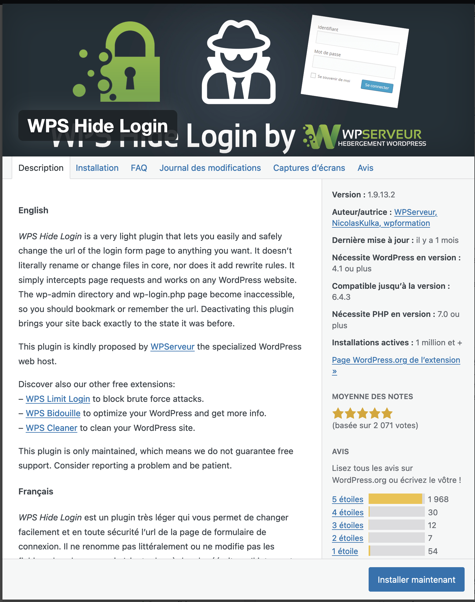</p>

4. Si le plugin vous convient, cliquez sur le bouton ``Installer maintenant``

<hr id="hide-login-page" />

# Cachez votre page de connexion

Les premières tentatives de brute force login via Wordpress se font généralement aux adresses ``votresite.fr/wp-admin.php`` ou ``votresite.fr/login`` ou ``votresite.fr/wp-login.php`` qui sont les 3 moyens d'accéder nativement à votre interface de connexion.

Il est donc primordial de "cacher" l'accès à cette interface du grand public en la personnalisant grâce à un plugin de type ``WPS Hide Login`` qui vous permettra de personnaliser le lien d'accès.

> NB : Si vous avez besoin d'un rappel, vous trouverez la procédure ici => [Comment installer un plugin](#install-plugins)

## L'activation & les réglages

1. Votre module est maintenant installé, il faut maintenant cliquer sur le bouton ``Activer``. 

> NB : Si vous ne voyez pas le bouton Activer ou que vous avez cliqué sur un autre onglet sans faire exprès, il vous suffit de vous rendre dans la partie ``Extensions``, vous retrouverez alors la liste des plugins installés, il vous suffit maintenant de l'activer. 

2. Une fois activé, cliquez sur ``Réglages`` sur votre plugin ou rendez-vous dans la partie ``Réglages > WPS Hide Login`` depuis votre menu administrateur.

<p align="center">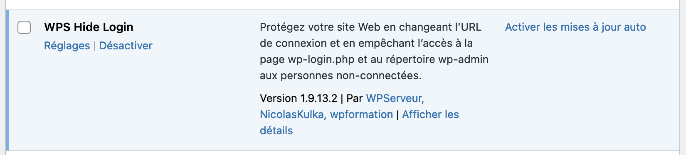</p>

3. Tout en bas de cette page, vous trouverez la partie liée à votre plugin :
  
  <p align="center"></p>

  - ``URL de connexion`` qui sera le lien avec lequel vous vous connecterez : modifiez "login" par le mot que vous souhaitez (ici en exemple à ne pas réutiliser : ``super-connexion``)
  
  <p align="center">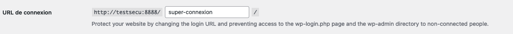</p>

  - ``URL de redirection`` qui sera la page vers laquelle seront redirigées les personnes tentant d'accéder aux pages ``votresite.fr/wp-admin.php``, ``votresite.fr/wp-login.php`` et ``votresite.fr/login`` (nous garderons dans l'exemple la page 404 qui sert aux pages introuvables)

  - Pensez ensuite à bien ``Enregistrer les modifications``


> NB : À partir de maintenant, rappelez-vous que pour vous connecter, vous devrez utiliser le lien que vous avez indiqué en ``URL de connexion``, dans notre exemple : ``votresite.fr/super-connexion``


<hr id="bf-login" />


# Limiter les attaque par Brute Force pour la connexion

*Une attaque par force brute (bruteforce attack) consiste à tester, l’une après l’autre, chaque combinaison possible d’un mot de passe ou d’une clé pour un identifiant donné afin se connecter au service ciblé.* source:[CNIL](https://www.cnil.fr/fr/definition/force-brute-attaque-informatique)

La première chose à faire pour en limiter les effets, est de limiter le nombre de tentatives et de bloquer les attaquants sur une période définie afin de les ralentir et de leur compliquer la vie.

Il existe plusieurs manières de faire et plusieurs outils, nous allons donc ici vous en présenter un qui se nomme ``WPS Limit Login``.

De la même manière que lors de l'installation du plugin ``WPS Limit Login``, il faut le rechercher, l'installer et l'activer.

> NB : Si vous avez besoin d'un rappel, je ne vais pas rentrer dans le détail, mais vous trouverez la procédure ici => [Comment installer un plugin](#install-plugins)

<p align="center">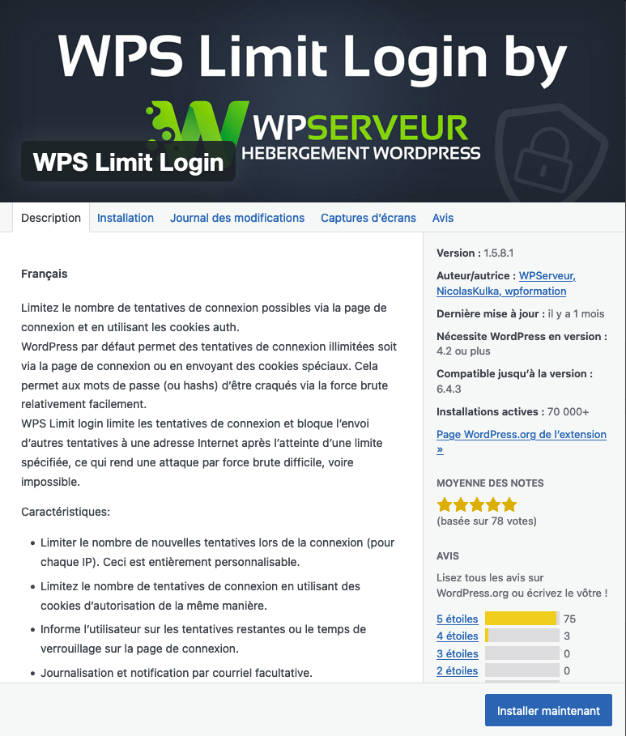</p>

## Les réglages

Lorsque vous accédez aux réglages de ``WPS Limit Login``, vous tombez sur le premier onglet ``Configuration``, dans lequel vous trouverez tous les paramétrages liés aux tentatives de connexion et aux limites que vous souhaitez fixer. (Nous verrons les autres onglets plus tard).

### Onglet Configuration

<p align="center">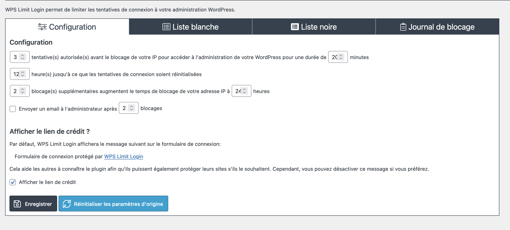</p>

1. Définissez le nombre de tentatives que vous souhaitez autoriser avant blocage ainsi que le temps de blocage souhaité pour l'adresse IP ayant fait les tentatives de connexion par brute force. 

> NB : Par défaut, 3 tentatives sont autorisées avant blocage et la durée pour le premier blocage est de 20 minutes. (Le temps durant lequel cette adresse IP ne pourra pas recommencer la procédure de connexion.)

2. Paramétrez le nombre d'heures jusqu'à ce que le nombre de tentatives soient réinitialisées. 

> NB : Par défaut, le plugin est paramétré sur 12 heures, ce qui veut dire que, si une adresse IP tente de se connecter plusieurs fois au cours d'une période de 12 heures d'affilés et que les identifiants de connexions sont erronés, les paramètres définis au point 1 seront pris en compte.

3. Paramétrez le nombre de tentatives supplémentaires et la durée de blocage pour cette nouvelles série de tentatives.

> NB : L'adresse IP ayant été bloquée 20 min suite à 3 tentatives de connexion erronées ( données par défaut comme expliqué au point 1), pourra de nouveau faire un certains nombre de tentatives avant d'être à nouveau bloquées selon cette nouvelle règle.
> Par défaut, le plugin autorise 2 tentatives supplémentaire une fois l'adresse IP débloquée. Si ces tentatives sont erronées, l'adresse IP sera cette fois bloquée pour 24 heures.

4. Afin de pouvoir être informé en cas de tentative de brute force, nous vous conseillons d'activer l'envoi d'e-mail à l'administrateur. 

> NB : Attention, un nombre trop élevé ici, peut être dangereux car vous risquez de ne pas voir suffisamment tôt les tentatives. Cependant, un nombre très bas, peut engendrer un grand nombre de mails. N'hésitez pas à tester, pour l'exemple, nous allons le laisser à 2. 

5. Nous allons donc, pour l'exemple, décocher ``Afficher le lien de crédit``.

> NB : Concernant le lien de crédit, nous partons du principe que plus il y a d'informations visible sur un système d'informations (ici pour votre site internet), plus on facilite la reconnaissance / énumération et la découverte de failles potentielles. 
> 
> Attention, il est primordial de soutenir les plugins et tout l'environnement gratuit / open source que vous utilisez et c'est pourquoi nous vous conseillons d'émettre un avis sur un plugin ou un outils que vous utiliseriez ou d'en parler autour de vous, mais ici, le fait d'afficher publiquement que le *formulaire de connexion est protégé par WPS Limit Login* pourrait aider lors d'une phase de reconnaissance ce qui serait de notre avis contre productif.

6. Pensez à enregistrer vos modifications avant de changer d'onglet.

### Onglet Liste blanche

Cet onglet vous permet de définir les adresses IP qui n'auront aucune limite de tentatives et qui ne seront jamais bloquées. 

Sauf cas particulier (et auquel cas, vous avez suffisamment de compétence pour gérer ce point), nous vous conseillons de ne poser aucune adresse IP en liste blanche. 

> NB : Vous connaissez votre mot de passe, en cas d'oubli, vous pouvez demander un nouveau mot de passe via le bouton ``Mot de passe oublié`` qui vous enverra un e-mail sur votre adresse d'administration.

### Onglet Liste noire

Cet onglet vous permet de définir les adresses IP que vous connaissez comme malveillantes via les outils de Cyber Threat Intelligence ou car elles apparaîssent souvent dans vos logs ou dans les tentatives de connexion par brute force. 

Par exemple, avec Be.Cyber Community, nous avons référencé un grand nombre d'adresses IP malveillantes que vous trouverez ici [Malicious Ip Adresses - Be Cyber Community](https://github.com/duggytuxy/malicious_ip_addresses) et que vous pouvez utiliser pour enrichir votre liste noire.

<p align="center">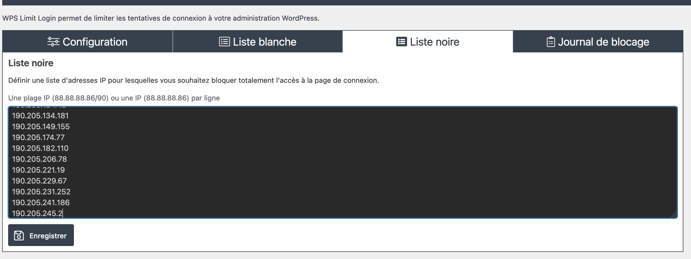</p>

### Onglet Journal de blocage

Enfin, vous retrouverez ici les statistiques de tentatives de connexion par brute force sur votre page de connexion ainsi que le journal de blocage.

<p align="center">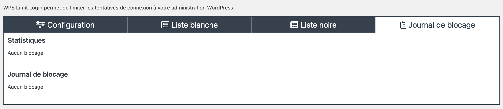</p>

<hr id="waf-scan" />

# Firewall, scanning & 2FA

***Firewall***

> Un pare-feu (firewall) sur votre Wordpress vous aidera à protéger votre site Wordpress des attaques en identifiant et bloquant le trafic malveillant.

***Scanning***
> Un scanner vous permet de bloquer du code ou contenu malveillant, de vérifier si vos fichiers ont été modifiés ...

***2FA***
> Two Factor Authentication (2FA) vous permet de rajouter une couche de sécurité sur votre site Wordpress lors de la connexion

Pour ce faire nous pouvons vous conseiller ``Wordfence``

## Wordfence

De la même manière que précédemment, il faut rechercher le plugin ``Wordfence Security – Pare-feu, scanner de logiciels malveillants, et sécurité de connexion``, l'installer et l'activer.

> NB : Si vous avez besoin d'un rappel, vous trouverez la procédure ici => [Comment installer un plugin](#install-plugins)

<p align="center">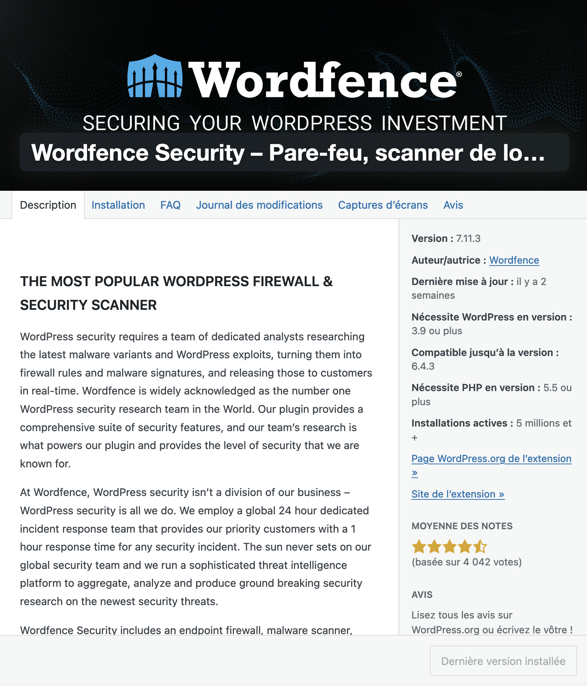</p>

## Les réglages

Une fois le plugin installé, vous devriez arriver sur une page vous demandant de rentrer votre licence ``Wordfence``ou de vous inscrire. 

<p align="center">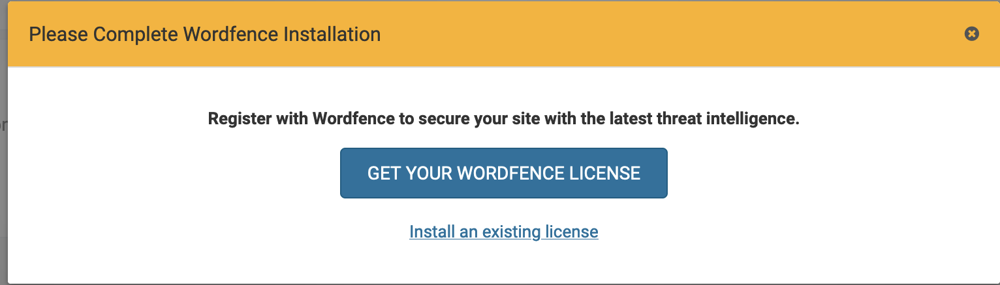</p>

1. Nous partons du principe que vous n'avez pas de licence, vous devrez donc en créer une.

> NB : Vous avez 4 licences disponibles, vous pouvez choisir celle qui vous convient le mieux. Notez que la licence "Free" fonctionne plutôt bien. Par contre vous ne bénéficierez pas de la mise à jour des nouvelles menaces en temps réel, mais avec un différé de 30 jours après leurs découvertes.

Une fois avoir créé un compte et avoir choisi votre licence, vous recevrez votre numéro de licence par e-mail. 

2. Sur votre module Wordfence, cliquez sur ``Install an existing license``, 

<p align="center">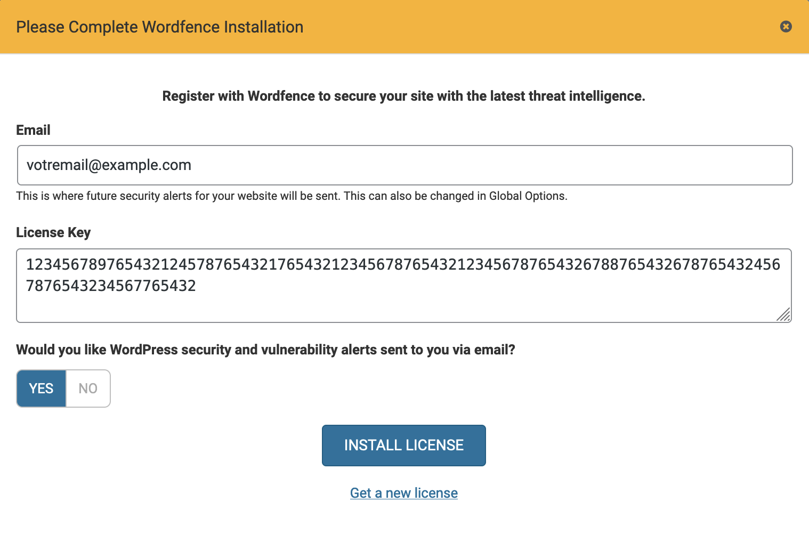</p>

- Renseignez votre e-mail de connexion 
- Ainsi que le numéro de votre licence reçue par e-mail (attention, votre licence doit rester confidentielle, ne la partagez pas, il s'agit ici, dans l'exemple, d'un nombre pris au hasard et non pas d'un numéro de licence valide)
- Cliquez ensuite sur ``YES`` pour accepter de recevoir des e-mails sur les alertes de sécurité et de vulnérabilités.

<p align="center">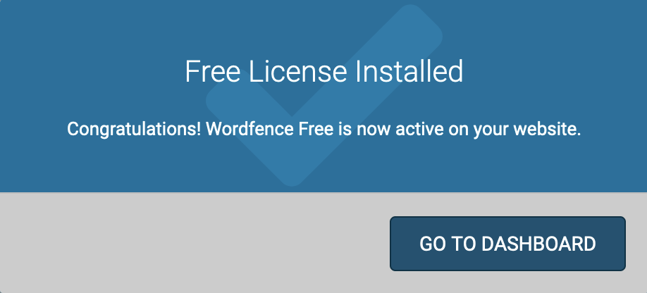</p>

> Félicitations, votre licence est valide, vous n'avez plus qu'à rejoindre le Dashboard.

### Dashboard

Sur votre Dashboard, vous trouverez les parties liées au ``Firewall``, au ``Scan``, ``Notifications`, vous pouvez suivre le didacticiel lors du premier affichage.

<p align="center">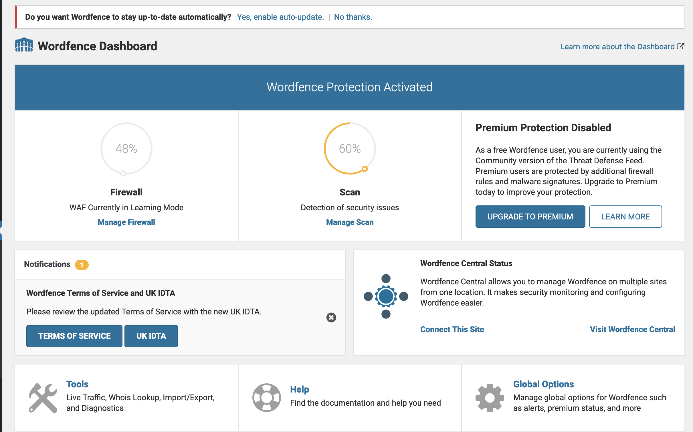</p>

> NB : Lors de votre arrivée sur le Dashboard, vous trouverez en haut un alerte en rouge, vous demandant d'activer les mises à jour automatiques du plugin. 

1. Nous vous conseillons de les mettre en application ou de faire vos mises à jour très régulièrement. 

> NB : Il est une bonne pratique de mettre très régulièrement à jour vos plugins et thèmes ou versions de Wordpress. Pensez cependant à faire des sauvegardes régulières de votre Wordpress AINSI QUE de votre base de données.

2. Cliquez sur ``Manage Firewall`` pour commencer à configurer ``Wordfence``.

### Firewall 

***Basic Firewall Options***

<p align="center">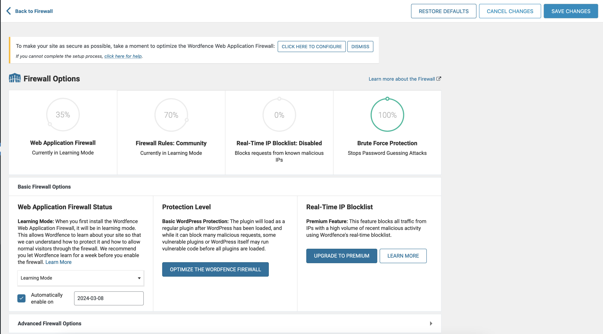</p>

1. Web Application Firewall Status (WAF)

Par défaut, lors de l'installation de Wordfence, le mode d'apprentissage est enclenché pendant 1 semaine. Il permettra au plugin d'apprendre comment le protéger par la suite, sans bloquer les utilisateurs légitimes. 

Au bout d'une semaine, il enclenchera automatiquement le pare-feu.

2. Protection level

Lors de l'installation, le "Basic Wordpress Protection" est d'office activé. 

Cependant, il pourra certes bloquer de nombreuses requête malveillante une fois le plugin chargé, mais certains plugins vulnérables ou Wordpress lui-même pourront parfois réussir à exécuter du code malveillant sans passer par le pare-feu.

Il est donc primordial d'optimiser le processus en modifiant la configuration PHP afin de lancer le pare-feu avant Wordpress ou tout autre fichier PHP. 

Pour se faire, il est nécessaire de modifier certains fichiers (en fonction de votre serveur) comme le ``.htaccess``, le ``php.ini``...

> NB : Dans tous les cas, ***AVANT TOUTE MODIFICATION***, il est primordiale de faire un sauvegarde intégrale de votre site et de votre base de données, afin de pouvoir remettre votre site en ligne en cas d'anomalie lors d'une mise à jour ou d'une erreur de configuration.

<p align="center">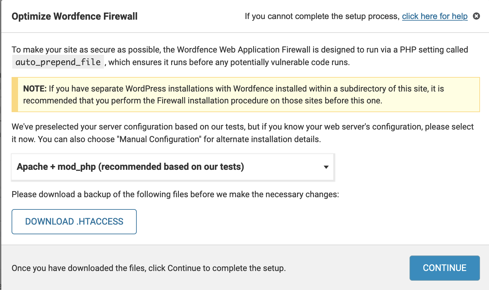</p> 

- En cliquant ``OPTIMIZE THE WORDFENCE FIREWALL``, vous aurez la possibilité de choisir la configuration serveur dont vous avez besoin. Le plugin vous proposera un fichier de configuration basé sur ses propres test.

- Téléchargez le fichier de configuratin en cliquant sur le bouton ``DOWNLOAD .HTACCESS``(dans le cadre de notre exemple avec Apache + mod_php, sinon veuillez suivre les informations adaptées pour votre serveur)

<p align="center">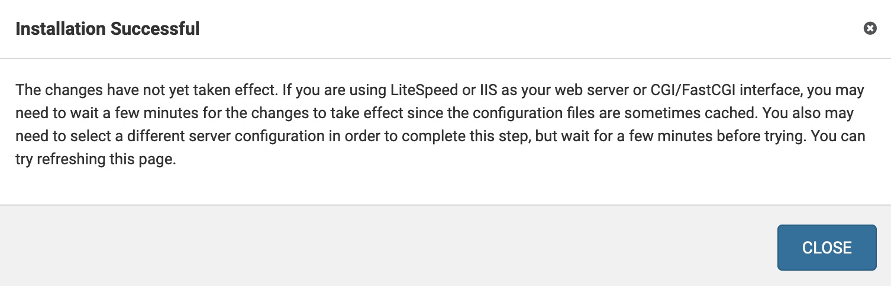</p> 

- Une fois téléchargé et sauvegardé quelque part en lieu sûr (pour pouvoir le remettre en cas de dysfonctionnement), cliquez sur continuer.

> NB : Dans certains cas, il se peut que la mise en cache de votre serveur ou qu'un plugin qui gère le cache sur votre Wordpress, retarde de quelques instants les nouveaux paramétrages. N'hésitez pas à recharger la page du Firewall pour vérifier que les modifications soient bien prise en compte.

<p align="center">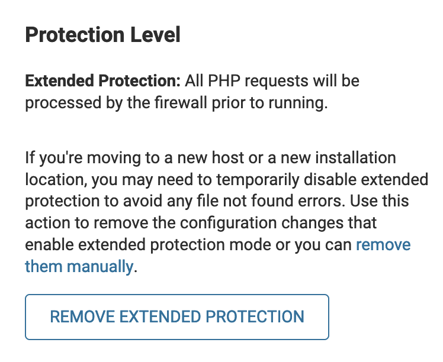</p> 

***Advanced Firewall Options***

Vous pourrez effectuer des réglages avancés en retardant les blockages IP, en autorisant certaines adresses IP à retarder les règles de pare feu ...

<p align="center">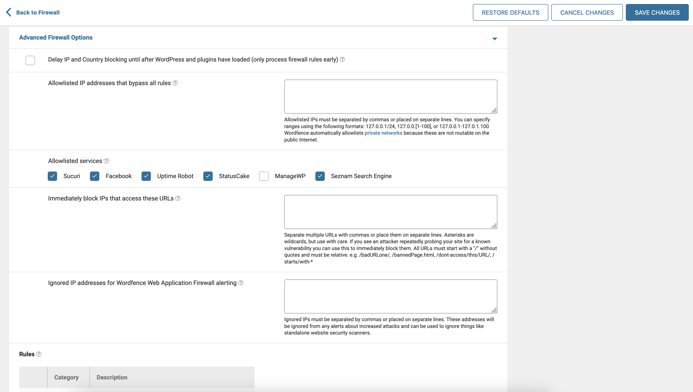</p> 

Par défaut, vous n'avez pas besoin d'y toucher sauf dans le cas où vous souhaiteriez affiner le pare-feu. 


***Brute Force Protection***

<p align="center">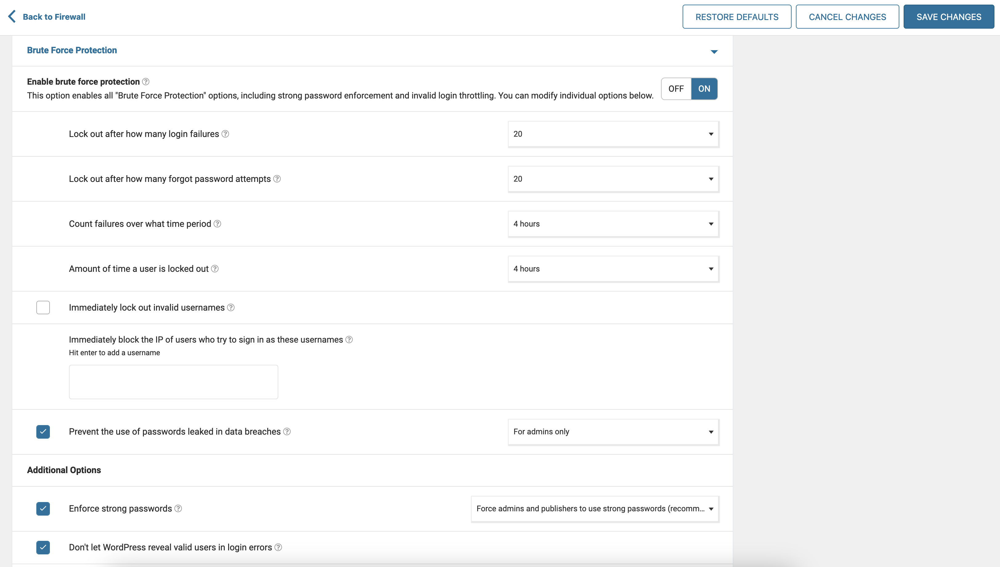</p> 

- Assurez-vous que la protection contre les attaques par brute force soient activée, si ce n'est pas le cas, cliquez sur ``ON``

> NB : Vous pourrez affiner le nombre de tentatives autorisées, le temps de blocage (comme dans le module ``WPS Limit Login`` installé précédemment).

- Vous pouvez choisir de bloquer immédiatement toute personne qui utiliserait un nom d'utilisateur invalide pour la connexion.

> NB : Attention, le fait d'immédiatement bloquer une personne après avoir utiliser un identifiant invalide peut faciliter l'énumération des utilisateurs existants. 

- Vous pouvez immédiatement bloquer toute personne utilisant certains nom d'utilisateurs, comme par exemple ``admin``, ``user``, ``root`` ... Pour cela, il vous suffit de rentrer le nom d'utilisateur qui déclenchera le bloquage et d'appuyer sur la touche ``Enter`` 

- Empêchez l'utilisation de mot de passe ayant fait l'objet d'une fuite de donnée pour tous les utilisateurs qui ont le droit de publier.

Dans la partie ``Additional Options``

<p align="center">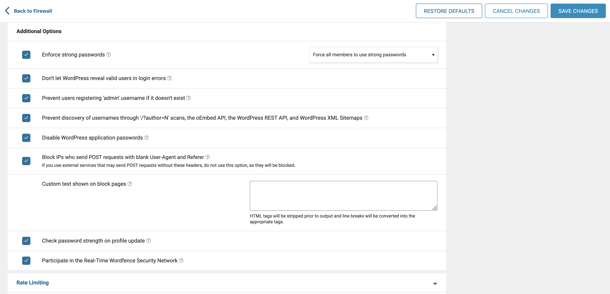</p> 

- Forcer l'utilisation d'un mot de passe fort pour tous les utilisateurs.

- Ne laissez pas Wordpress révéler les utilisateurs valides dans les erreurs de connexion.

- Empêchez les utilisateurs d'enregistrer un nom d'utilisateur ``admin`` même s'il n'existe pas déjà.

- Empêchez la découverte des noms d'utilisateurs par les scans, oEmbed, API Rest Wordpress ou encore les sitemap XML de Wordpress.

- Désactivez les mots de passe d'applications de Wordpress.

- Bloquer toutes les adresses IP qui envoient des requêtes POST avec un ``user-agent`` et ``referer`` vides.

- Vérifier la force du mot de passe lors de la modification d'un profil utilisateur.

- Enfin, si vous souhaitez enrichir la base de connaissance sécuritaire de la communauté vous pouvez envoyer de manière anonyme des informations sur les tentatives de piratage. 

***Rate Limiting***

<p align="center">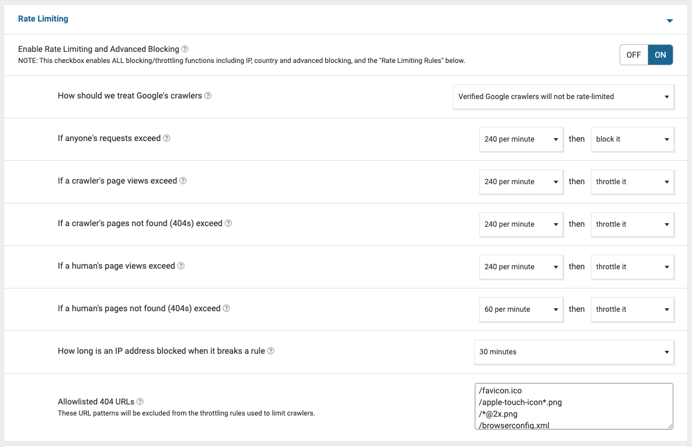</p> 

- Choisissez comment vous souhaitez traiter les robots d'indexation de Google : ``Ici, nous prenons le parti de ne pas limiter les robots de Google qui sont vérifiés``

Nous allons décider du comportement (limiter ou bloquer) à prendre lorsque le nombre d'évènements par minutes va être dépassé pour les points suivants :

- Le nombre de requêtes de n'importe qui

- Le nombre de pages vues par un crawler (robot)

- Le nombre de pages non trouvées (404 not found) par un crawler (robot)

- Le nombre de pages vues par un humain

- Le nombre de pages non trouvées (404 not found) par un humain

> NB : Pour les points ci-dessus, attention à vos choix et à ne pas être trop incisif dans vos décisions. Une alerte apparaîtra si vous êtes un peu trop sévère, mais dans tous les cas, évitez le ``Unlimited``

- Pendant combien de temps une adresse IP est bloquée lorsqu'elle enfreint une règle ? Nous règlerons ici à ``30 minutes`` pour l'exemple.

***AllowListed URLs***

<p align="center">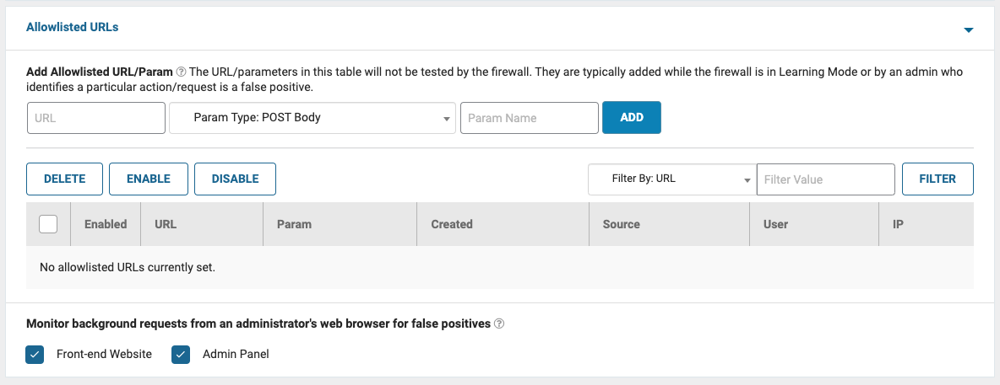</p> 

Cette partie vous permettra définir des URL qui ne seront pas prise en compte par le pare-feu. 

Elles peuvent également être ajouter automatiquement lorsque le pare-feu est en mode d'apprentissage.

Si vous ne savez pas précisément ce que vous faites, laissez cette partie telle quelle.

Enfin pensez à sauvegarder les changements en cliquant sur le bouton ``Save Changes``en haut à droite.

### Scan

<p align="center">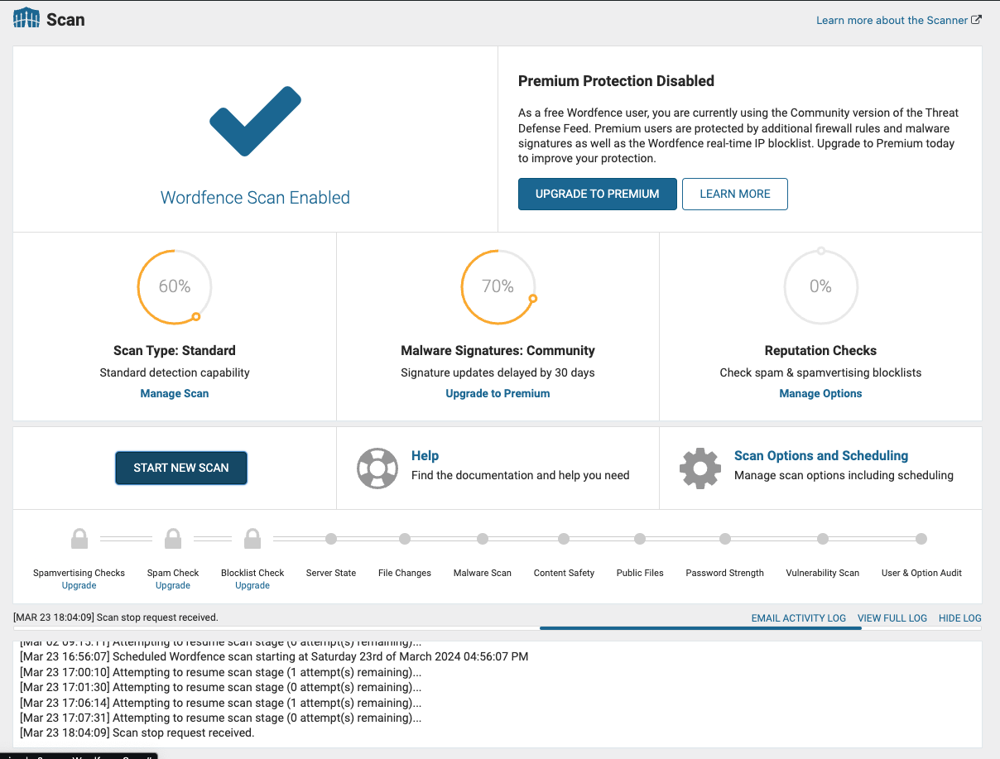</p>

Dans cette partie, Wordfence va vous permettre de scanner votre site :

- De manière régulière pour étudier les vulnérabilités liées à des fichiers qui auraient été modifiés ou des plugins/thèmes qui auraient besoin de mises à jour.

- De manière manuelle, pour lancer un scan total de votre site Wordpress en cliquant sur ``Start New Scan``

> NB : Une fois le scan fini, vous aurez le détail du scan disponible en cliquant sur ``Show Log``, ainsi que les parties validées ou présentant une erreur. 

- Pensez à paramétrer le niveau de scan souhaité en cliquant sur ``Manage Scan`` (Choix possible entre Limited, Standard et High sensitivity). Nous choisissons ``High sensitivity`` avant de lancer le scan.

### Live Trafic

Le Live Trafic (trafic en direct), affiche par défaut un résumé de tout le trafic lié à la sécurité et nous indique à quoi le trafic est rattaché? (Human, Bot, Warning, Blocked).

<p align="center">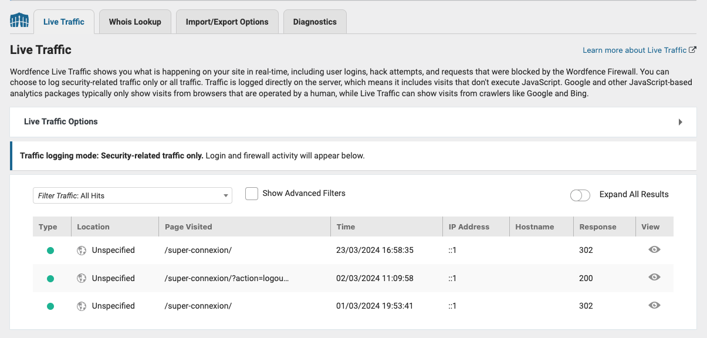</p>

***Live Trafic Options***

Vous pouvez également affiner votre Live Trafic en choisissant :

- Le mode d'enregistrement du trafic : ``Security Only`` ou ``All Trafic``. 

> NB : Nous garderons le mode ``Security`` car le All Trafic peut facilement se révéler conséquent, être contre productif et peut coûter cher en terme de ressources

- Si vous ne souhaitez pas suivre les utilisateurs avec un accès de publication (administrateur, éditeur ...) et cacher leur activité dans le live trafic, il faudra cocher cette case.

- Vous pouvez choisir les utilisateurs que vous souhaitez ignorer, en les séparant par une virgule ``,`` 

- Vous pouvez également ignorer des adresses IP en les ajoutant et en les séparant par une virgule ``,``

- Renseignez ensuite la liste des ``user-agent`` que vous souhaitez ignorer 

> NB : Nous vous conseillons de ne toucher aux 3 précédents points, que si vous savez exactement ce que vous faites

- Choisissez le nombre de lignes maximum qui seront sauvegardées ( 2000 par défaut )

- Ensuite, choisissez le nombre de jour durant lesquels vous conserverez les données de trafic, entre 1 et 30 jours ( 30 par défaut )

<p align="center">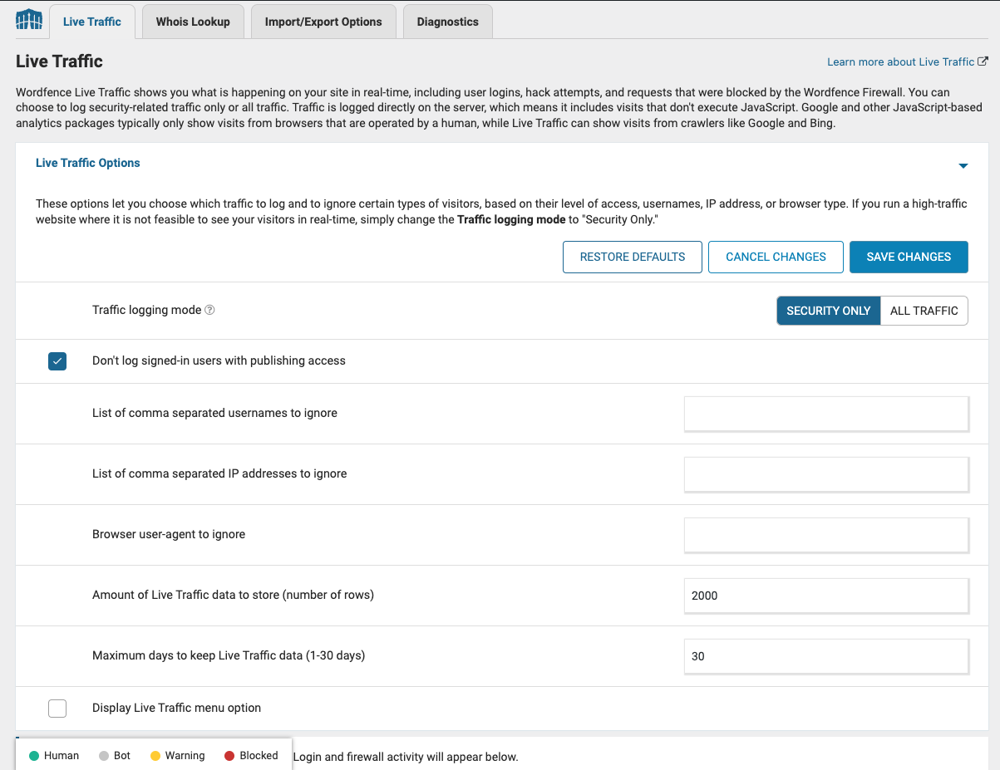</p>

### Login Security 

C'est ici que vous pourrez activer l'authentification à deux facteurs (2FA ou Two-Factor Authentication). 

Il s'agit d'une méthode pour rajouter une couche de sécurité lors de la connexion à votre site Wordpress, car une fois avoir rentré vos identifiants et mots de passe, Wordfence vous demande un code pour valider la connexion.

> NB : Nous vous conseillons fortement de mettre en place l'authentification multi-facteur (MFA / 2FA) partout où vous le pouvez, que ce soit sur logiciels de messagerie e-mails, vos réseaux sociaux, vos banques, sites administratifs (partout où cela est possible).

<p align="center">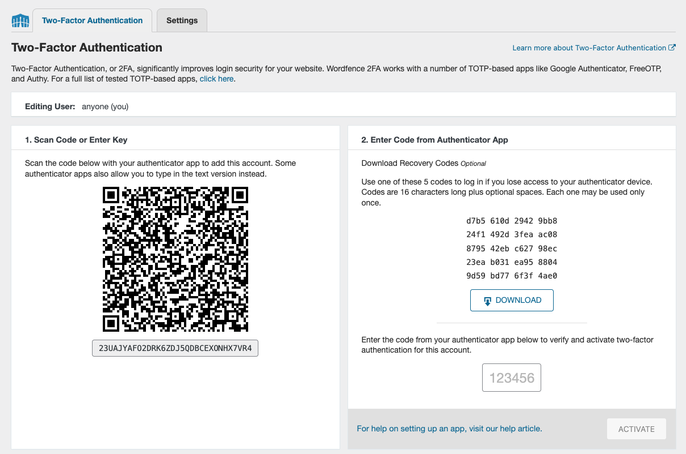</p>

***Activation de l'authentification à 2 facteurs***

1. Choisissez l'application que vous souhaitez utiliser pour mettre en place votre authentification à 2 facteurs

> NB : Il est écrit dans la liste que Wordfence accepte les Apps TOTP (comprendre ``Time-Based One-time Password``) suivantes : Google authenticator, FreeOTP, LastPass authenticator, Microsoft authenticator ... (nous vous invitons à suivre le liens présent sur votre page pour avoir la liste exhaustive et en temps réel)

2. Scannez le QRCode présent à l'écran dans votre application TOTP (Si vous n'avez pas d'appareil photo fonctionnel, vous pouvez aussi renseigner le code qui est sous le QRCode).

3. OPTIONNEL : Téléchargez les code de récupération et sauvegardez les de manière sécurisé dans un trousseau prévu à cet effet, ``Ne les laissez jamais en accès libre dans votre dossier de téléchargement, sur votre bureau ou autre``.

4. Renseignez le code généré par votre application TOTP afin de valider l'authentification à deux facteurs. 

> **ATTENTION** : Nous vous présentons ici le QRCode, le code ainsi que les code de récupération en clair pour l'exemple car l'installation est faite sur un LAB en local, destiné à cet effet et sera effacé dès la fin de la rédaction de ce guide. ***``NE DÉVOILEZ JAMAIS VOTRE QRCODE, LE CODE EN DESSOUS, NI LES CODES DE RÉCUPÉRATION, ILS SONT PRIVÉS ET DOIVENT ÊTRE GARDÉS EN LIEU SÛR AFIN D'ÉVITER TOUTE UTILISATION MALVEILLANTE``***

***Settings***

Dans cette partie, nous allons régler tout ce qui est lié à l'authentification à 2 facteurs que nous venons de mettre en place. 

<p align="center">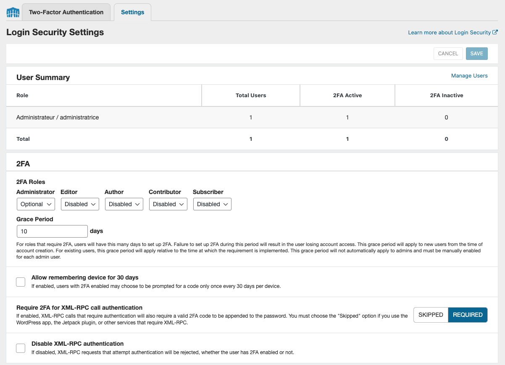</p>

Dans la première partie, ``User Summary``, vous trouverez la liste des utilisateurs existant sur votre site Wordpress, avec le détail de leurs rôles, ceux pour qui l'authentification à deux facteurs est active ou ne l'est pas.

1. ``2FA Rôles`` : Nous vous conseillons de régler les différents rôles ***Administrator***, ***Editor***, ***Author***, ***Contributor*** et ***Subscriber*** sur ``Required`` afin de forcer le 2FA pour tous les utilisateurs. 

2. ``Période de grâce`` : Les utilisateurs qui ont un rôle avec un 2FA obligatoire, auront un nombre de jours (défini intialement à 10) pour se mettre en conformité et activer l'authentification à 2 facteurs. Au delà de cette période, il perdra accès à son compte. ***Nous vous conseillons de mettre un délai le moins long possible, et si possible ``0`` si c'est faisable dans le cadre de votre organisation.***

> NB : Ce délai est également applicable lors de la création de nouveaux utilisateurs, la période grâce débutera dès la création du compte.

3. Vous pouvez autoriser la mémorisation d'un appareil pendant 30 jours. Attention, c'est plus simple au quotidien, cependant ce choix augmente le risque, surtout dans le cas où l'appareil mémorisé est compromis ou si vous perdez votre appareil. ***Nous vous conseillons donc de le laisser désactivé.***

4. Définissez le 2FA pour l'authentification des appels XML-RPC (même si nous désactiverons ce service plus tard). Ça aura au moins le mérite, dans le cas ou XML-RPC soit mal désactivé, de bloquer les appels extérieurs sans 2FA.

> NB : Attention, si vous utilisez des plugins comme Jetpack ou tout autre plugin ayant besoin d'XML-RPC pour fonctionner, vous devez sélectionner ``Skipped``, mais pour ces cas seulements. 

5. Désactivez XML-RPC, cette option interdira toute tentative d'authentification par le biais de ce service, que l'utilisateur ait activé l'authentification à 2 facteurs ou non. 

> NB : La encore si vous utilisez des plugins comme Jetpack ou tout autre plugin ayant besoin d'XML-RPC pour fonctionner, attention à ne pas le désactiver. 

La partie suivante est intéressante dans le cas où vous utiliseriez le plugin de e-commerce pour Wordpress - Woocommerce, sinon vous pouvez le laisser tel quel.

<p align="center">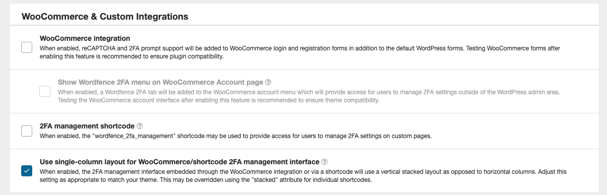</p>

1. Woocommerce integration : Si vous activez cette partie, recaptcha ET 2FA seront ajoutés aux formulaires de connexion et d'enregistrement de Woocommerce, en plus des formulaires Wordpress par défaut.

> NB : Pensez à tester vos formulaire après avoir activé cette options pour vous assurer qu'il n'y ait pas de problème avec certains plugins.

2. 2FA Management shortcode : les shortcodes permettent aux utilisateurs de gérer des paramètres 2FA sur des pages personnalisées. Nous ne vous conseillons pas d'y toucher sauf si vous connaissez PHP et savez modifier les fichiers.

3. La mise en page en une seule colonne vous permettrea d'intégrer l'interface de gestion 2FA via Woocommerce de manière vertical (plutôt qu'en horizontal). Il faudra donc l'ajuster en fonction de votre thème.

Le reCAPTCHA permet de limiter les bots en proposant de résoudre des "challenges". 

<p align="center">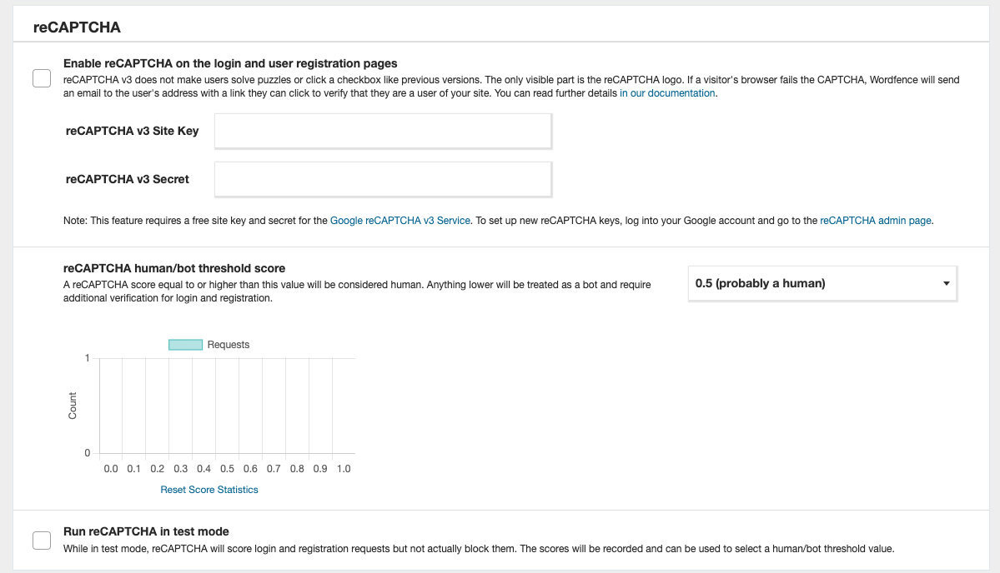</p>

1. Nous vous recommandons d'activer reCAPTCHA sur les pages de connexion et d'enregistrement utilisateur. Ici c'est la version 3 de reCAPTCHA qui est utilisé. Cette version à pour avantage de ne pas forcer les utilisateurs à résoudre des énigmes ou à cliquer sur une case pour valider le visiteurs comme étant humain.

> NB : Ce service nécessite de créer un compte gratuit sur Google reCAPTCHA v3 afin de générer la paire de clef Privée (secret) et Publique (site key)

2. Une fois la paire de clef renseignée, vous pouvez définir les curseurs (le score). Tout les scores reCAPTCHA égal ou supérieur au score que vous aurez choisi seront considérés comme ***humain***, tous les scores inférieurs seront considérés comme des ***bots***.

3. Vous pouvez lancer le reCATCHA en test mode afin d'évaluer les demandes de connexion et d'enregistrement. Les scores seront alors enregistrés afin de pouvoir définir la valeur à sélectionner.

La partie General vous permettra quant à elle d'affiner vos réglages liées à l'authentification 2FA ou le reCAPTCHA

<p align="center">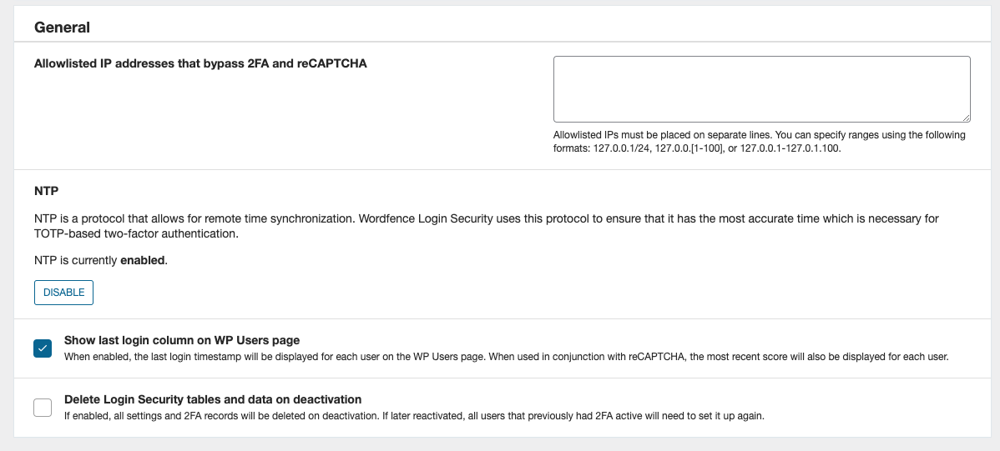</p>

1. Vous pouvez autoriser certaines listes IP à outrepasser l'authentification à 2 facteurs et le reCAPTCHA en les renseignants dans ce champs et en prenant soin de ne mettre qu'une adresse ou plage IP par ligne.

2. NTP : Il s'agit d'un protocole permettant la synchronisation du temps à distance. Il est utilisé par Wordfence Security Login afin de s'assurer qu'il dispose de l'heure la plus précise permettant l'authentification à 2 facteurs de fonctionner correctement. En effet, TOTP étant basé sur le temps, cette synchronisation est importante.

3. Nous vous recommandons d'afficher la colonne des dernières connexion sur la page utilisateur. Elle permettra d'avoir un meilleur monitoring et permettra à l'utilisateur concerné de pouvoir s'assurer que la connexion était légitime.

4. ATTENTION : Vous pouvez effacer l'ensemble des tables et des données en cas de désactivation. Nous vous conseillons de le faire dans le cas où vous souhaiteriez désinstaller Wordfence uniquement.

Une fois toutes ces étapes réalisées, pensez à sauvegarder avant de passer à la suite ou de changer de page.

Félicitations, la grosse partie Firewall, Scanning & 2FA est terminée.

<hr id="remove-wp-version" />

# Effacer la version Wordpress

Encore une fois, il est primordial de limiter les informations que l'on diffuse afin de complexifier le processus d'énumération. 

Plus nous cachons les outils et services que nous utilisons, plus nous nous mettons "à l'abri" des menaces. Nous allons donc faire en sorte de cacher la version de Wordpress que nous utilisons.

> ATTENTION : faites une sauvegarde avant toute modification dans le code source, surtout dans le cas où vous n'êtes pas à l'aise avec le code.

<p align="center">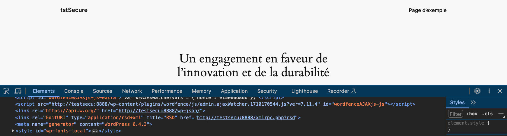</p>

Pour éditer un fichier vous avez 2 possibilités:

1. La première et la plus recommandée, est de modifier le fichier function.php de votre thème en local depuis votre éditeur de code préféré puis de l'envoyer sur votre serveur.

2. La seconde, depuis le menu ``Outils > Editeur de fichiers des thèmes`` 

Trouvez le fichier ``function.php`` de votre thème, puis à la fin du fichier, ajoutez le code suivant : 

```php
// Nous ajoutons cette partie pour retirer la version wordpress de notre site
add_filter('the_generator', 'my_delete_version'); 

function my_delete_version() { 
return ''; }
```

Bravo, votre version de Wordpress n'apparait maintenant plus dans votre code.

<hr id="remove-yoast-version" />

# Effacer la version YOAST SEO

YOAST est un plugin performant pour le référencement SEO de votre site Wordpress, mais bien qu'il soit performant, il diffuse, lui aussi, son numéro de version dans le code de votre site, ce qui est une aubaine pour les personnes qui souhaiteraient trouver une vulnérabilité liée à votre version de plugin.

<p align="center">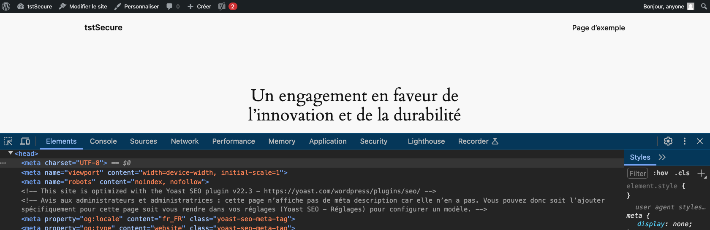</p>


De la même manière que pour la version Wordpress, ouvrez le fichier ``function.php``de votre thème et insérez-y le code suivant à la fin (tout en ayant pris soin de faire une sauvegarde avant).

```php
// Delete yoast version
add_action('wp_head',function() { ob_start(function($o) {
return preg_replace('/\n?<.*?yoast seo plugin.*?>/mi','',$o);
}); },~PHP_INT_MAX);
```
<p align="center">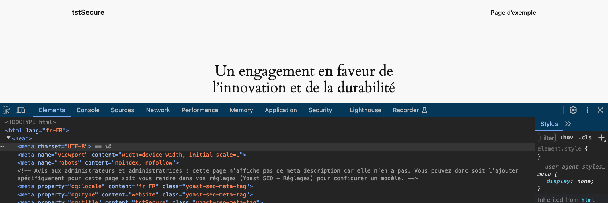</p>

Bravo, votre version de YOAST n'apparaît maintenant plus sur votre site.

<hr id="remove-css-js-version" />

# Effacer les versions CSS et JavaScript

Nous allons également cacher les versions des CSS et Js dans le code de notre site, là encore pour diminuer la surface d'attaque et ne pas afficher les versions inutilement.

```php
function remove_css_js_version( $src ) {
    if( strpos( $src, '?ver=' ) )
        $src = remove_query_arg( 'ver', $src );
    return $src;
}
add_filter( 'style_loader_src', 'remove_css_js_version', 9999 );
add_filter( 'script_loader_src', 'remove_css_js_version', 9999 ); 
```

<hr id="backup" />

# Bonnes pratiques - Sauvegardes

Il est important de pratiquer des sauvegardes (backup) régulières de vos sites internet.

On vous le répète souvent, mais pourquoi, quand, quoi et comment faire pour avoir des sauvegardes viables et de qualité?

## Pourquoi ?

Une sauvegarde de qualité, autrement dit, une sauvegarde dont on est certain qu'elle contient l'intégralité du site et dont l'intégrité est respectée, vous permettra de remettre votre site en ligne en cas d'anomalie (suppression malencontreuse, bug, piratage ...) dans les délais les plus courts possibles. 

C'est pourquoi il est primordiale qu'elle soit effectuée en respectant certaines règles et qu'elle contienne la dernière version exploitable de votre site internet (ou les dernières versions dans certains cas, on reviendra dessus), tout en s'assurant de l'intégrité de votre sauvegarde.


<span id="when-to-backup"></span>

## Quand ?

Nous vous conseillons d'effectuer une sauvegarde dès qu'une de ces situations se produit :

- Vous modifiez votre site internet, que ce soit dans le contenu textuel, la mise en page ou toute modification technique. En gros dès que vous faites un changement sur votre site.

- Avant de mettre à jour un plugin, un thème ou votre version de Wordpress 

> Note : Si plusieurs mises à jour sont à faire en même temps, une seule sauvegarde suffit.

- Après avoir fait votre mise à jour et que tout s'est bien passé.


*Mise à jour automatique, en plus des point ci-dessus :*

Pour le cas des blogs, site avec espace utilisateurs, boutique en ligne ..., en gros si plusieurs acteurs interviennent sur votre blog (une communauté par exemple), nous vous conseillons de faire des sauvegardes régulières, avec une périodicité qui dépendra du flux de données et d'intéraction que votre site / blog.

Par exemple : 

- Peu de nouveaux utilisateurs ou de données changeantes : 1 sauvegarde par quinzaine ou par mois à minima.

- Des modification fréquentes : 1 sauvegarde par semaine ou par quinzaine à minima.

- Des modifications très fréquentes (par exemple, e-commerce) : Des sauvegardes les plus fréquentes possible, pouvant aller de chaque heure à, au max tous les 2/3 jours.

> Note : ***Ces recommandations sont estimées et ne sont en aucun cas des périodicités absolues***. Si vous avez un énorme flux de données une sauvegarde par heure peut-être intéressante pour avoir le moins de perte possible en cas d'anomalie, cependant, ça demande aussi plus d'espace de stockage nécessaire (hors serveur du site) et une régularité importante demande une organisation. 

L'idée est de pouvoir revenir, en un cours laps de temps, à une situation la plus proche qu'elle était avant l'anomalie.

## Quoi ?

Sur Wordpress il y a différents éléments à sauvegarder.

- Tout ce qui est "contenu textuel" et configurations de plugin / thèmes / Wordpress (hors fichiers de configurations pur lié au code source) est sauvegardé dans votre base de données.

- Tout ce qui est fichiers (documents, images ...) et codes sources sont stockés sur l'espace de stockage de votre serveur.

Par conséquent, lors d'une sauvegarde, il est primordial de **sauvegarder à la fois les fichiers stockés sur le serveur ET votre base de donnée**, sans quoi votre sauvegarde ne sera pas complète et deviendra inutile.


## Comment ? 

Il y a plusieurs solutions pour sauvegarder votre site Wordpress en intégralité.

- [Avec un plugin de sauvegarde](#backup-plugin)

- "A la main" (nous ne rentrerons pas ici dans le détail pour Wordpress, ça fera l'objet d'une prochaine publication)

Nous allons donc ici vous détailler la manière avec plugin afin de vous guider pas à pas.

<hr id="backup-plugin" />

### Avec un plugin de sauvegarde

Il faut tout d'abord, comme pour tout plugin, faire attention à ce qu'on utilise et choisir un plugin avec soin. 

> NB : Si vous avez besoin d'un rappel, vous trouverez la procédure ici => [Comment installer un plugin](#install-plugins)

Concernant les plugins de sauvegardes, nous vous conseillons également de vérifier les points suivants : 

- Propose t'il une sauvegarde complète du site?

- Permet-il d'automatiser les sauvegardes et de gérer leurs fréquences?

- Permet-il de télécharger notre sauvegarde sur notre ordinateur (en lien direct, en envoi par mail ou en sauvegarde sur un espace distant.)

> NB : Nous attirons votre attention sur *la possibilité de sauvegarde sur un espace de stockage distant*. En effet, si le plugin transfert lui même la sauvegarde sur votre cloud par exemple, cela veut dire que vous autorisez à votre plugin d'accéder et à écrire directement sur votre cloud, ce qui, en cas de compromission du plugin ou de votre site Wordpress, peut permettre d'accéder à vos données distantes, voir de les exfiltrer. 

Nous allons ici nous concentrer sur un des plus réputés en la matière, il s'agit du plugin ``UpdraftPlus``, il vous suffit donc de sauvegarder votre site, puis à rechercher le plugin, à l'installer et enfin à l'activer.

> NB : Si vous avez besoin d'un rappel, vous trouverez la procédure ici => [Comment installer un plugin](#install-plugins)

<p align="center">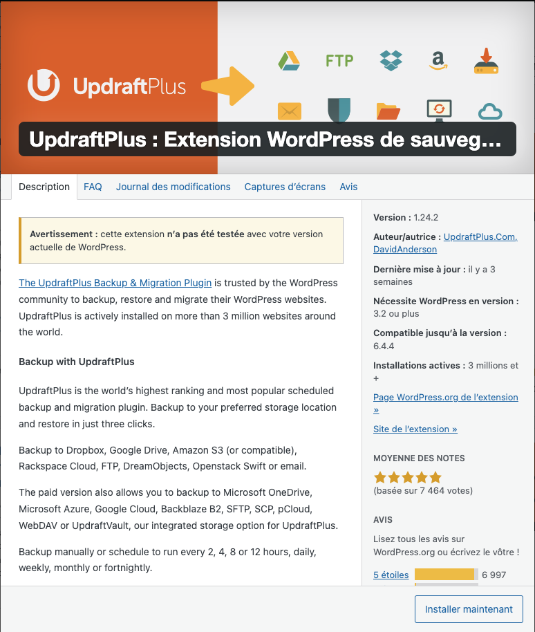</p>

> NB : Attention, au moment de l'écriture de ces lignes, la version de Wordpress 6.5.2 vient de sortir et le plugin n'a pas encore été testé pour cette version, nous vous conseillons donc la plus grande prudence si ça vous arrive lors du choix d'un plugin et de son installation. Nous allons ici l'utiliser et nous veillerons à l'évolution du plugin afin de nous assurer que le tutoriel soit viable.

Une fois installé, vous pouvez retrouver votre plugin dans la liste de vos extensions. Il vous suffit de cliquer sur réglages.

<p align="center">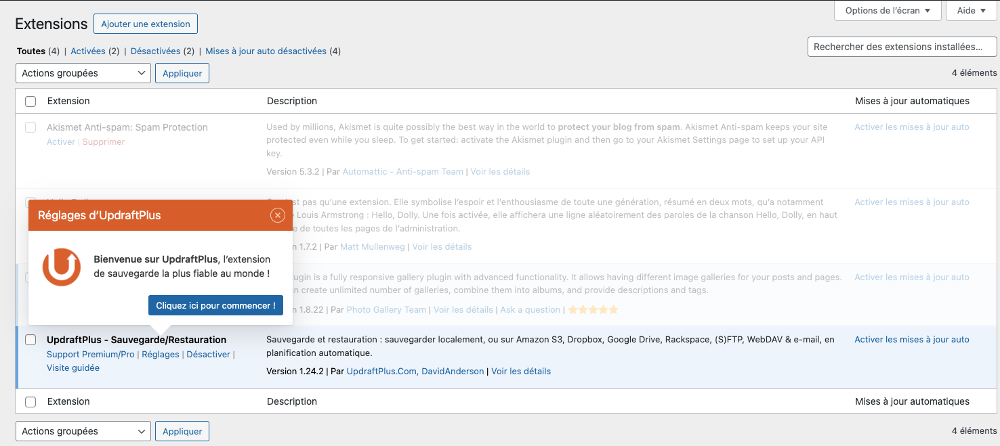</p>

Lors de votre arrivée sur le plugin d'UpdraftPlus, un "pas à pas" vous est proposé afin de pouvoir apprendre son fonctionnement, il vous propose également de sauvegarder votre site. Nous vous invitons à le lire par curiosité ou pour un complément d'information de notre ``security guide``.

Nous reviendrons sur la partie ``sauvegarder/restaurer`` à la fin, nous allons d'abord vous présenter les éléments à mettre en place sur le plugin pour qu'il réponde à vos besoins.

> Note : Nous vous conseillons fortement la lecture de ces différents points afin de configurer votre plugin directement, cependant, voici le lien pour accéder directement à la partie [Sauvegarde / Restauration](#backup-restore)

***Migrer / Cloner***

<p align="center">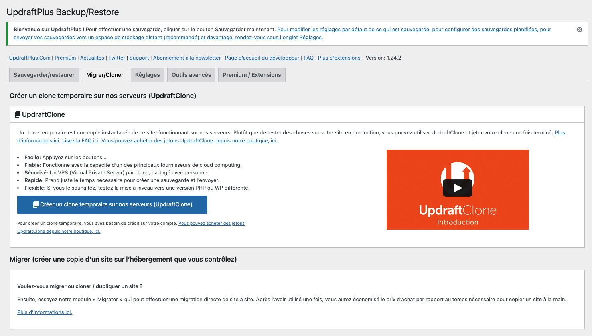</p>

Cette partie vous permet de créer un clône temporaire sur les serveurs d'UpdraftPlus, afin de tester les mises à jour, nouveaux thèmes ... sans risque de planter votre site. Une fois terminé, il vous suffit de supprimer le clône.

> Note : Nous attirons que cette partie est payante et charge l'intégralité de votre site sur leurs serveurs (code source et base de données incluses). Nous ne vous disons pas de ne pas l'utiliser, cependant, nous souhaitions vous alerter sur ces points que vous puissiez prendre votre décision en toute connaissance de cause.

Cependant, si vous effectuez bien les sauvegardes avant de faire une mise à jour, vous aurez toujours la possibilité de remettre votre site en ligne en cas de problème lors d'une mise à jour.

Cette partie vous propose également un module ``Migrator`` pour vous permettre de cloner / dupliquer ou migrer votre site sur un autre serveur.

***Réglages***

<p align="center">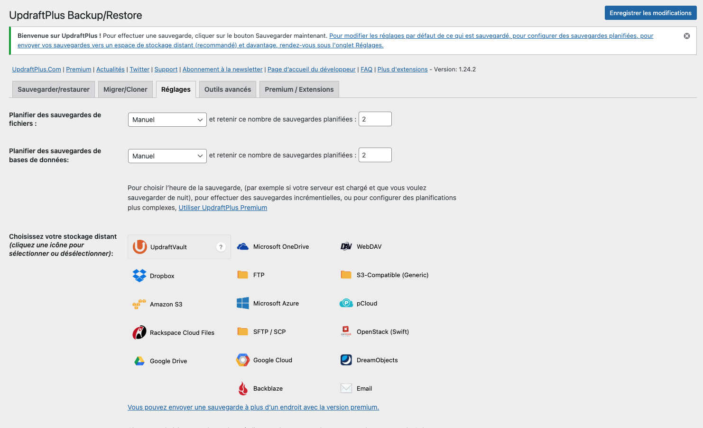</p>

Cette partie va vous permettre de planifier les sauvegardes de vos fichiers et de votre base de données à la périodicité souhaitée, ainsi que le nombre de sauvegardes que vous souhaitez garder.

Pour l'exemple, nous allons partir sur la mise en place de mises à jour automatique pour un site avec des modifications peu fréquentes.

> Note : Dans sa version gratuite, ce plugin offre des solutions limitées, notamment d'un point de vue sécurité. Nous allons donc vous guider au mieux dans le cadre d'une offre gratuite.

1. Comme indiqué dans la partie ``Quand?``, nous allons partir sur une sauvegarde automatique à périodicité mensuelle pour les fichiers et la base de données, ainsi qu'un stockage des 2 dernières sauvegardes.

<p align="center">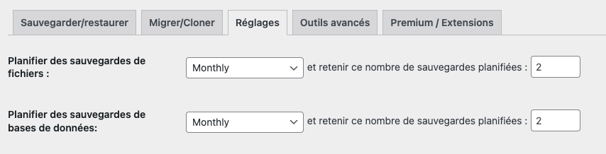</p>

2. Il est maintenant temps de choisir le type de stockage distant souhaité en cliquant sur l'icône correspondante. 

Nous n'allons choisir aucun service pour le stockage car en version gratuite.

- Nous ne pourrons pas envoyer nos données de manières sécurisé par SFTP/SCP vers un serveur externe
- Nous ne pourrons pas chiffrer nos bases de données pour un envoi par email, ce qui reviendrait à envoyer nos données en clair et qu'elles soient interceptable par un acteur malveillant
- Nous préférons éviter de connecter notre Wordpress à notre Cloud pour éviter des fuites en cas de failles de sécurité.

Si vous souhaitez tout de même utiliser un service distant, vous devrez choisir le service souhaité et rentrer vos identifiants de connexion. 

**ATTENTION, nous déconseillons fortement la solution ``FTP`` car elle transfèrerait vos données sans chiffrement vers vos serveurs, autrement dit, toutes vos données seront envoyées en clair, et toute personne qui se placerait entre le flux de données et vos serveurs pourra lire les données transférées, ce qui n'est pas du tout recommandé**

<p align="center">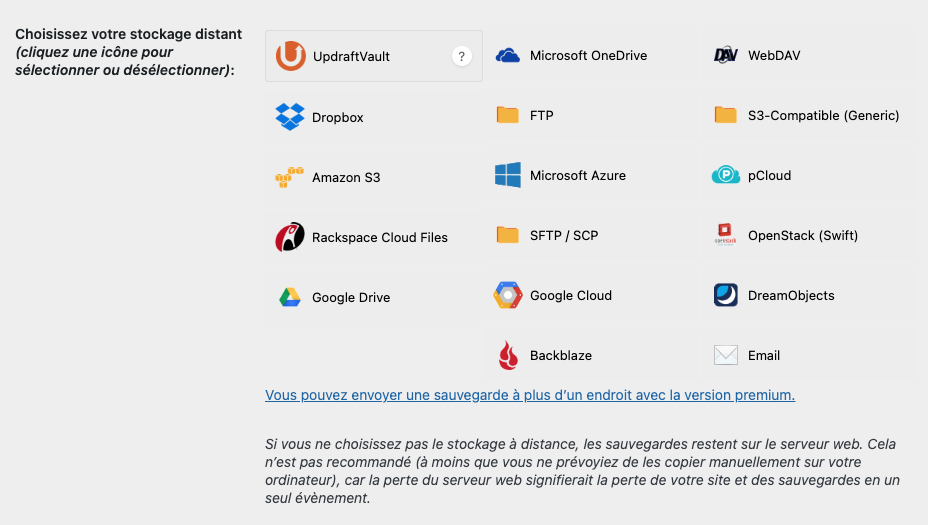</p>

3. Il est maintenant temps de passer à la partie des éléments à inclure dans la sauvegarde.

- Nous allons laisser ce qui est coché initialement à savoir ``Extensions``, ``Thèmes`` et ``Téléversement`` pour que nous ayons l'intégralité de notre site sauvegardé.

- Cependant, nous allons exclure des Téléversements, les éléments ``backup*``, ``*backups``, ``backwpup*``, ``wp-clone``, ``snapshot``

> Note : le signe ``*`` correspond à ce qu'on appelle un ``catch-all``, ce qui veut dire qu'il prends en compte tous les caractères précédent ou suivant le terme auquel il est attaché. Par exemple, ci-dessus, en utilisant le terme ``backup*``nous allons exclure tous les éléments qui commencent par backup, peu importe le caractère qui suit. De fait, un fichier s'appellant ``backup-20240412-mon-site`` seront concernés par l'exclusion.

- Nous allons laisser les éléménts ``Extensions indispensables``et ``Tout autre répertoire trouvé dans wp-content``

> Note : Le dossier ``wp-content``, est le dossier de Wordpress dans lequel vient s'enregistrer les thèmes, les plugins, les téléchargements, les fichiers cache, les sauvegardes ...

- Nous allons ensuite exclure les éléments portants le nom ``upgrade``, ``cache``, ``updraft``, ``backup*``, ``*backups``, ``mysql.sql``, ``debug.log``

Vous pourrez également ajouter des règles d'exclusion en fonction de vos situations personnelles.

<p align="center">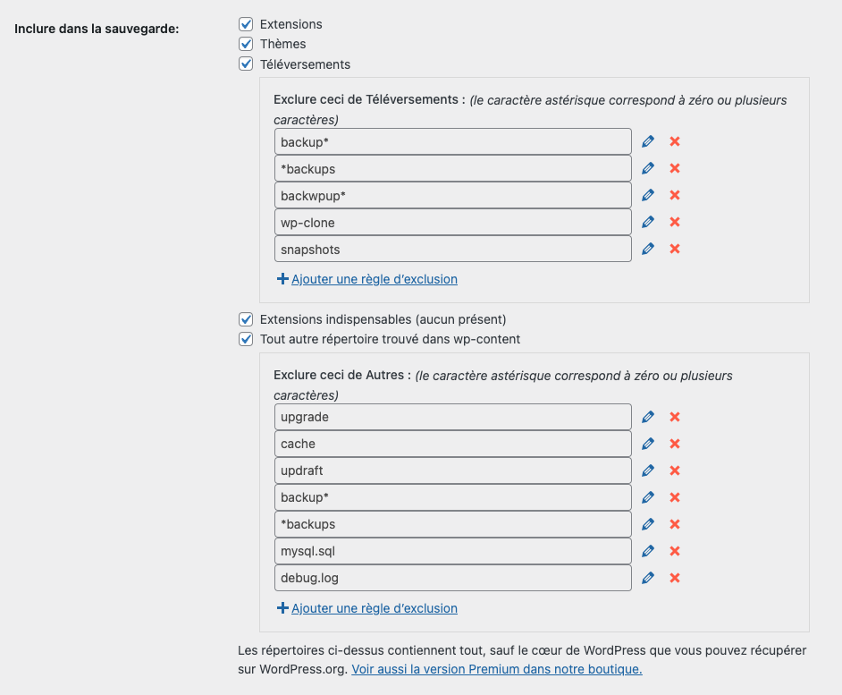</p>

4. Dans cette dernière partie, nous allons surtout vous expliquer à quoi ça correspond.

- La ``phrase de chiffrement de la base de données`` vous permet, dans le cas où vous soyez utilisateur premium, de chiffrer la base de données avant transfert ou stockage. Ce qui est un point plutôt positif.

- Nous allons coché ``Courriel`` afin de recevoir un rapport simple à l'adresse email de l'administrateur du site.

<p align="center">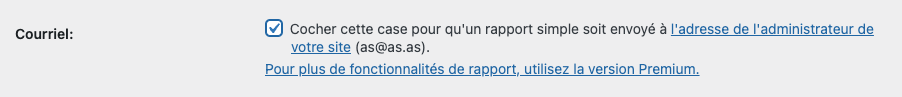</p>

- Dans la partie ``Réglages avancés``, nous allons nous concentrer sur la partie ``Répertoire de sauvegarde``.

Nous allons modifier le nom du dossier par défaut, car qui dit défaut, dit que c'est le premier mot qui va être recherché si quelqu'un cible les utilisateurs de ce plugin.

Pour exemple, nous allons changer le nom ``updraft`` par ``monfichier``, puis nous allons sauvegarder.

<p align="center">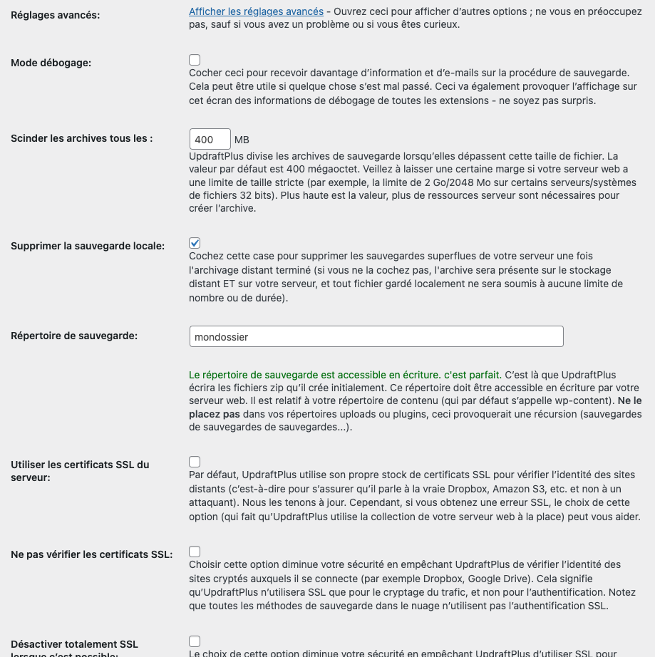</p>

> Note : Vous mettrez un nom de dossier qui vous convient et qui n'est pas trop évident, mais pensez à ne mettre que des lettres, sans caractères spéciaux ni tirets.

Il faut également penser à retourner dans la partie exclusion afin d'exclure le nouveau nom ``mondossier``

<p align="center">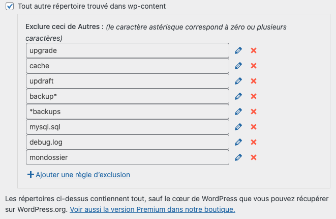</p>

<span id="backup-restore"></span>

***Sauvegarder / Restaurer***

Nous arrivons enfin dans la partie, ``Sauvegarde / Restauration``, partie dans laquelle nous pouvons gérer nos sauvegardes, les télécharger, les restaurer ...

Vous retrouverez ici, le bouton pour télécharger votre site, les *journaux* ainsi que les sauvegardes existantes, si vous avez déjà effectuer des sauvegardes via le plugin, ou si vous avez défini une periodicité pour les sauvegardes automatiques, comme vu précédemment.

<p align="center">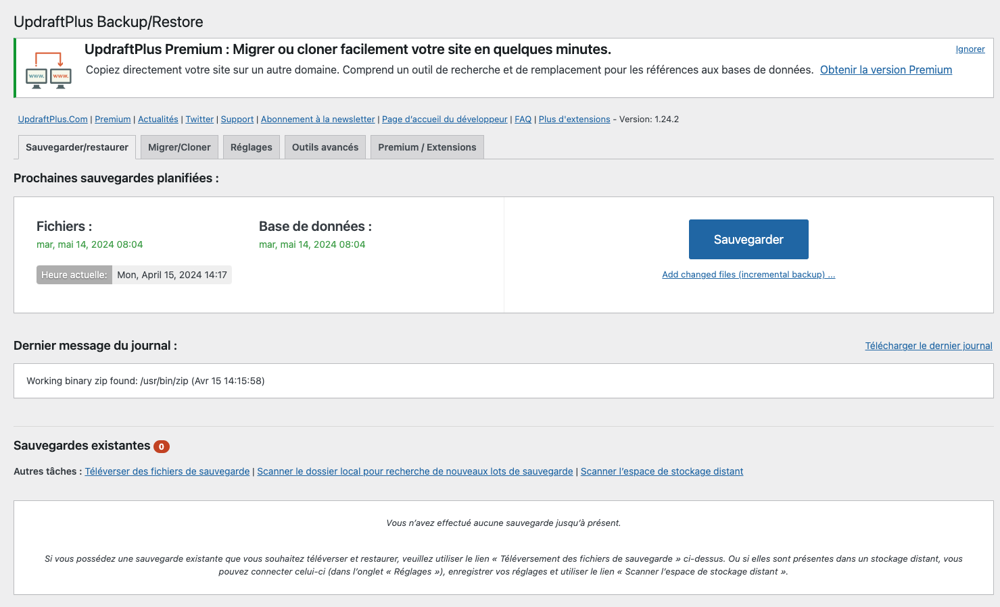</p>

> Note : Vous voyez ici, sur la capture d'écran, que nous avons programmé des sauvegardes automatiques mensuelle, et que la prochaine sauvegarde automatique des fichiers ET de la base de donnée, aura lieu ``mardi 14 mai à 08:04``.

Nous vous invitons, si ce n'est pas déjà fait, à consulter la partie expliquant [Quand faire vos sauvegardes](#when-to-backup), afin d'adopter les bonnes pratiques et vous assurer de revenir à *"l'image'* la plus proche de votre site en cas d'anomalie.

**Effectuer une sauvegarde manuelle**

1. Cliquez sur le bouton ``Sauvegarder`` sur la partie droite de votre site 

2. Sélectionnez ce que vous souhaitez inclure dans votre sauvegarde. Nous allons choisir d'inclure la ``base de donnée`` ainsi que ``les fichiers``, puis cliquer sur ``Sauvegarder``.

> Note : Vous verrez ici l'information comme quoi *la sauvegarde ne sera envoyée vers aucun stockage distant* car nous l'avons paramétré ainsi. Nous n'autoriserons pas non plus la conservation de la sauvegarde au delà des limites de rétention prévues. 

<p align="center">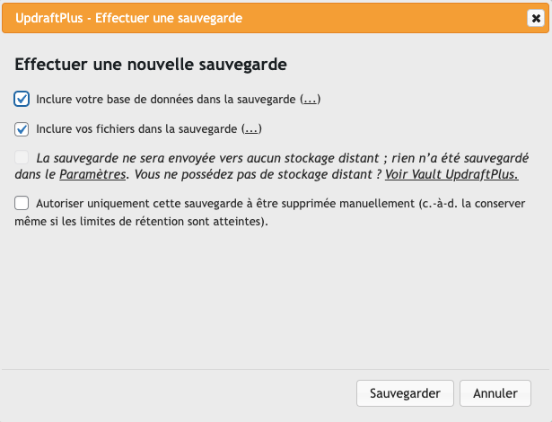</p>

Une fois la sauvegarde effectuée, vous la retrouverez en bas de la page, dans la partie ``Sauvegarde existantes``, avec la date et l'heure de la sauvegarde, les types d'éléments sauvegardés et les actions ``Restaurer``, ``Supprimer`` et ``Voir le journal``.

<p align="center">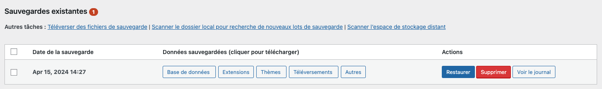</p>

Nous n'avons pas encore fini avec la sauvegarde. 

Il est important de ne jamais supposer qu'une sauvegarde s'est bien passée ni qu'elle est exploitable. En effet, dans certains cas, même si nous pensons que la sauvegarde s'est bien passée, elle présente des anomalies et risque d'être inexploitable au moment où l'on en aura besoin. 

C'est pourquoi il est important de s'assurer de la fiabilité de notre sauvegarde avant de la considérée comme sûre.

Avant de télécharger notre sauvegarde, nous allons commencé par effectuer une restauration. 

> Note : Vu que nous venons de faire la sauvegarde, la restauration de celle-ci ne changera rien à notre site, elle peut donc être faite sans risquer d'avoir eu des modifications entre temps.

**Vérifier la viabilité de notre sauvegarde**

1. Nous allons cliquer sur le bouton ``Restaurer``

2. Nous allons choisir les éléments à restaurer, par conséquent, ici, vu que nous souhaitons tester l'intégralité de la sauvegarde, nous allons sélectionner tous les éléments, puis cliquez sur ``Suivant``.

<p align="center">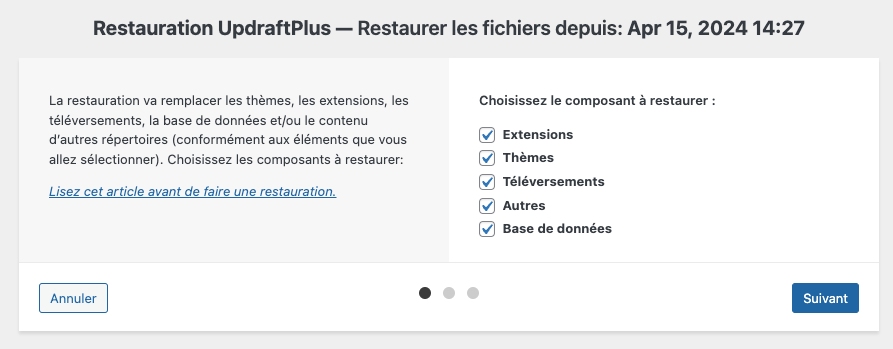</p>

3. Le système nous informe que les fichiers d'archives ont été traîtés avec succès, nous propose d'exclure des tables de la base de donnée en cas de besoin puis de lancer la restauration. Nous souhaitons tout vérifier, nous allons donc cliquer sur ``Restaurer``.

<p align="center">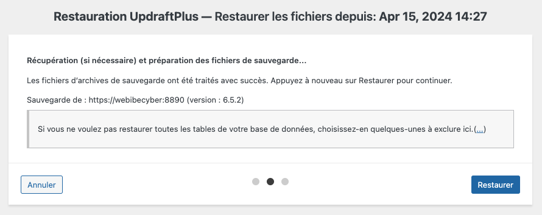</p>

4. Une fois effectuée, le système nous indique que la restauration est un succès, la sauvegarde est donc viable, nous allons pouvoir la télécharger.

<p align="center">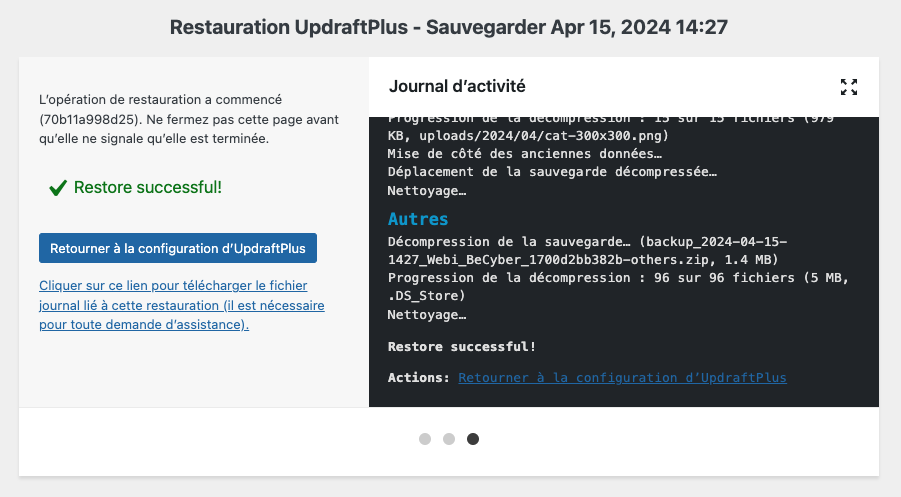</p>

> Note : Le système vous demande maintenant, de retourner à la configuration (autrement dit la page sur ``Sauvegarder / Restaurer``) et/ou de télécharger le fichier de journal lié à cette restauration. Nous passerons sur ce point ici, s'agissant d'un simple téléchargement, mais il est toujours bon d'avoir des journaux de ce type d'opération en cas de besoins.

**Télécharger notre sauvegarde**

Pourquoi télécharger une sauvegarde alors qu'elle est déjà stockée sur votre site?

C'est précisément car elle est stockée sur votre site qu'il va falloir la télécharger.

Une sauvegarde stockée sur l'hébergement de votre site, est pratique en cas de restauration mais en cas de défaillance de votre serveur, de piratage ou tout autre anomalie sur votre site, elle a de forte chance d'impacter votre sauvegarde et par conséquent, toute vos sauvegardes risques d'être inutilisable et vous ne pourrez pas remettre votre site en ligne.

C'est donc une bonne pratique de stocker ses sauvegarde à d'autres endroits que sur le serveur hébergeant votre site. 

> Note : Nous vous conseillons 2 lieu de stockage en plus, 2 disques durs différents, 1 serveur et un disque dur ... Ce qu'il est important de comprendre c'est que les réplicas vous offrent une garantie dans le cas ou l'un des lieu de stockage présente une défaillance.

Sur UpdraftPlus, une sauvegarde regroupe plus précisément plusieurs dossiers de sauvegardes qui sépare (pour notre configuration) la ``Base de données``, les ``Extensions``, les ``Thèmes``, les ``Téléversements`` et une catégorie ``Autres``.

1. Nous allons cliqué sur les boutons des parties précédemments citées, ce qui va nous ouvrir un encart pour télécharger la sauvegarde de la partie concernée

<p align="center">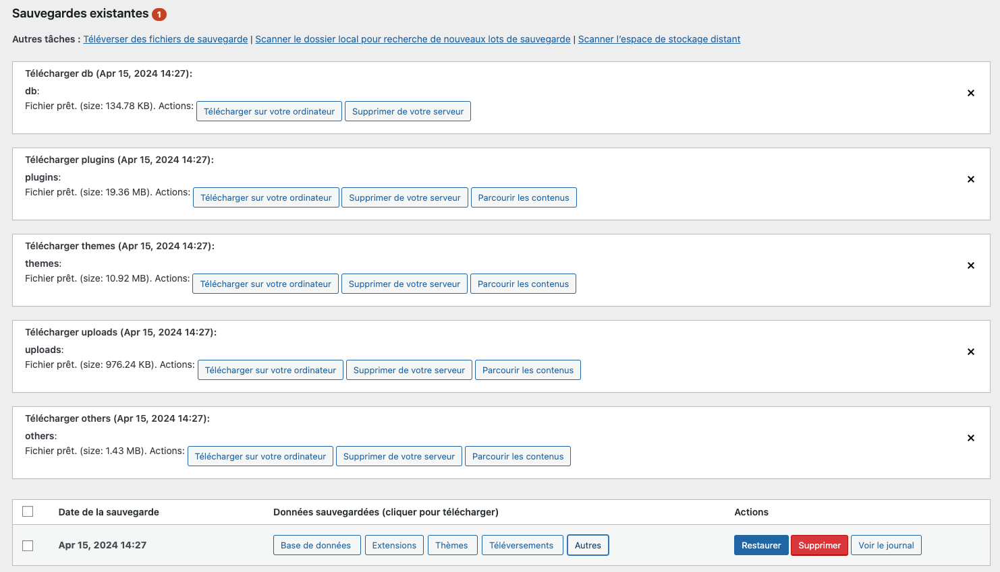</p>

2. Nous allons créer un dossier, à l'endroit où nous souhaitons stocker nos sauvegardes (hors de l'hébergement de notre site), en le nommant selon la convention suivante ``DATE-nomdusite-backup``, en prenant soin d'indiquer la date de notre sauvegarde, ce qui nous donne ici ``20240415-webibecyber-backup``.

<p align="center">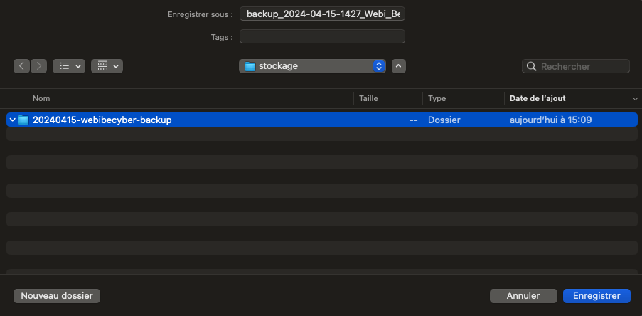</p>

3. Nous allons cliquer sur ``Télécharger sur votre ordinateur`` ***pour toutes les parties de la sauvegarde***, sélectionner notre dossier ``20240415-webibecyber-backup`` et cliquer sur ``Enregistrer```

Vos fichiers sont maintenant sauvegarder dans le dossier créé précédemment.

> Note : Comme indiqué les solutions FTP et emails enverraient en clair les données de vos sauvegardes et n'importe quelle personne entre le lieu distant et votre flux de données pourrait intercépter les données, les lire et les exfiltrer. En procédant de la sorte, vous allez profiter du certificat SSL/TLS de votre site afin de télécharger vos sauvegardes en ``HTTPS``, sur la capture ci-dessous ``https://webibecyber:8890`` (où 8890 est le port utilisé par notre machine locale mais vous auriez ``https://votresite.com`` pour votre site)

<p align="center">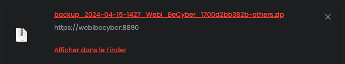</p>

Il ne vous reste plus qu'à dupliquer ces opérations vers votre 2e support de stockage et votre sauvegarde est terminée.

**Durée de conservation de votre sauvegarde**

Une sauvegarde peut vitre être gourmand en terme de poids (comprendre taille de la sauvegarde), par conséquent, il peut être intéressant de supprimer les sauvegardes les plus vieilles afin de libérer de l'espace et surtout de ne pas vous retrouver avec 15 ans de sauvegardes qui n'auraient aucune utilité.

Cependant, réfléchissez soigneusement, sur le nombre de sauvegardes que vous souhaitez conserver (soit en nombre de sauvegarde, soit en période écoulée) car si vous effacer trop régulièrement vos sauvegardes, ou à contrario que vous les gardez trop longtemps, vous risquez d'être soumis à des problématiques.

1. **De fiabilité** : En effet, il peut arriver que l'on ne découvre un piratage ou des fichiers compromis qu'au bout d'une certaine durée. Car certains systèmes, pour se faire discrets, attendent un laps de temps avant de se déclencher ou d'être effectifs. Par conséquent si vous ne gardez qu'une semaine de sauvegarde, alors que le fichier malveillant s'est déclenché au bout de 2 mois, vous risquez de ne plus avoir de sauvegarde saine et chaque restauration réinstallera le fichier malveillant.

2. **Réglementaires ou legislatives** : Car le RGPD (***Réglement Général sur la Protection des Données***) vous interdit de garder des données personnelles au delà de la période nécessaire et justifiée. D'autre part la loi peut exiger que vous gardiez une trace des données ou transaction sur une durée minimum (ou au maximum) et en fonction du cadre contractuel, de la garantie ...

Ces cas sont des cas pouvant considérablement varier en fonction de votre activité, votre situation, vos obligations légales ... Nous ne pourrons donc pas vous conseiller sur la durée de conservation et vous recommandons de vous rapprocher d'un avocat spécialisé, d'un cabinet juriste ou d'un DPO - ***Data Protection Officer*** (DPD - ***Délégué à la Protection des Données*** en Français).

<hr id="update" />

# Bonnes pratiques - Mises à jour

Comme pour tout système informatisé, il est primordial de faire des mises à jour régulières afin de vous assurer d'avoir la dernière version de vos plugins / thèmes et Wordpress lui-même sur votre site.

## Pourquoi ?

Pour la bonne et simple raison que les mises à jours servent à apporter des modifications, des fonctionnalités, des évolutions en terme de performance mais surtout, car elles permettent d'apporter les correctifs de sécurité nécessaires pour protéger votre système contre des vulnérabilités découvertes.

>NOTE : Avant toutes mises à jour de plugins, de thèmes et de versions, ou avant tout changement majeur en termes de contenu, il est primordial d'effectuer une sauvegarde et de s'assuré de la viabilité de celle-ci. Vous pouvez retrouver les démarches dans la partie [Bonnes pratiques - Sauvegarde](#backup)

## Comment se passe une mise à jour sur Wordpress ?

Pour effectuer sur mise à jour sur Wordpress il vous suffit de vous rendre dans la partie ``Tableau de bord > Mises à jour`` de votre espace administrateur. 

Vous y trouverez la liste des mises à jour en attente, aussi bien pour la ``version de Wordpress``, les ``plugins``, les ``thèmes`` ainsi que les ``traductions``.

<p align="center">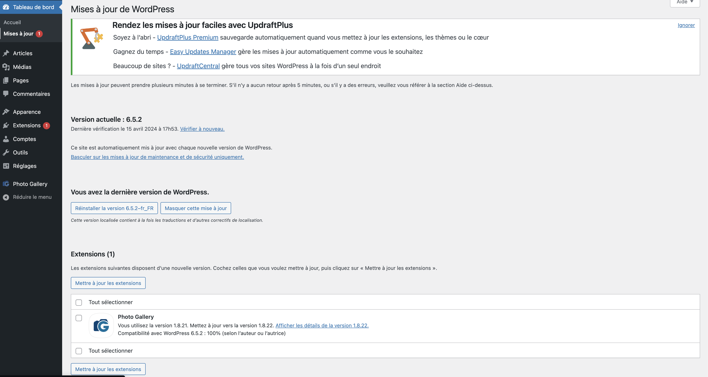</p>

Nous voyons dans l'exemple qu'une extension est en attente de mises à jour, il s'agit du plugin ``Photo Gallery`` dont une faille de sécurité à été révélée il y a quelques jours, nous allons donc mettre à jour ce plugin.

Avant d'effectuer la mise à jour, nous allons examiner ce qui nous est proposé :
  
  - La version actuellement installée ``1.8.21``
  - La version proposée pour la mise à jour ``1.8.22``
  - La compatibilité avec notre version de Wordpress ``6.5.2`` qui est ici indiquée à 100% selon l'auteur

<p align="center">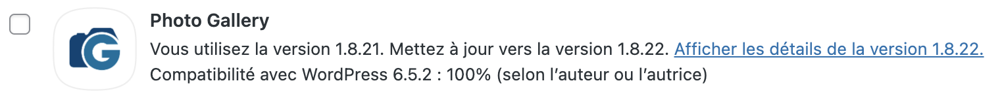</p>

Nous pouvons également voir plus de détails sur ce plugin et sur la version ``1.8.22`

Nous voyons notamment les failles qui ont été patchées au sein de cette mise à jour, la date de dernière mise à jour ...

<p align="center">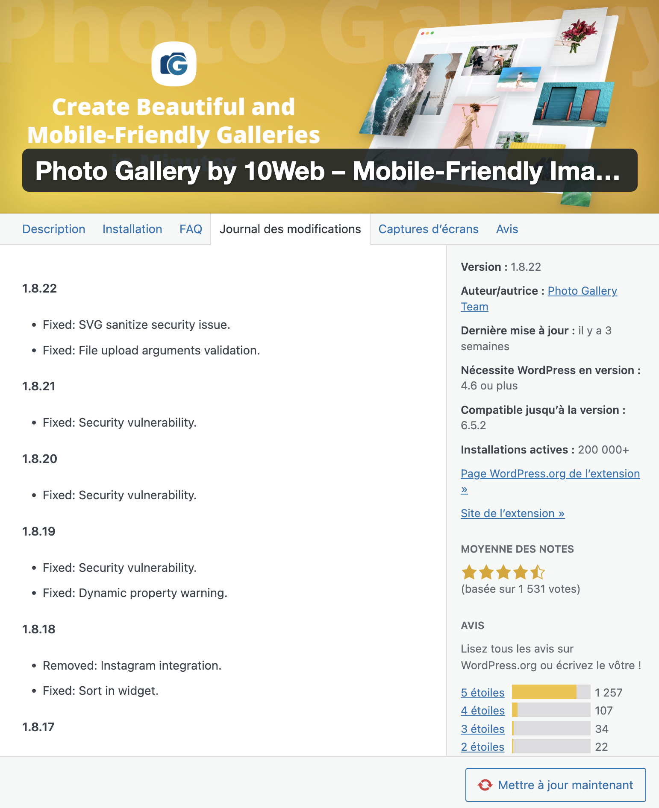</p>

Si cela nous convient, nous pouvons donc faire la mise à jour. (N'oubliez pas de faire la sauvegarde correctement, comme expliqué dans la partie [Bonnes pratiques - Sauvegarde](#backup) )

Félicitation, votre plugin est à jour.

> Note :  Il est fréquent de se retrouver avec plusieurs mises à jour disponible simultanément. Dans une telle situation, vous pouvez par exemple sélectionner toutes les extensions et les mettre à jour en une seule fois, mais soyez prudent à bien avoir vérifier la compatibilité de chaque extension auparavant.

***WORK IN PROGRESS***

<hr />

***Remerciements :***

Ce référentiel à été réalisé afin de permettre à toute personne, même peu à l'aise avec le code, de pouvoir améliorer la sécurisation de ses serveurs et de ses sites Wordpress de manière la plus simple possible, en ce contexte cyber assez particulier.

Nous espérons que ce référentiel vous a plu, qu'il aidera le plus de monde possible, alors n'hésitez pas à le partager à toute personne qui en aurait besoin.

Nous le tiendrons à jour le plus régulièrement possible et nous le ferons évoluer sur différents sujet Cyber, alors gardez ce référentiel en favori pour en profiter 👩‍💻👨‍💻

Merci pour votre intérêt et nous vous disons à très bientôt pour plus de contenu.

<hr>

***Crédits :***

- **Tyc-Tac** : Be.Cyber Community

- **Cr4Sh** : Be.Cyber Community - Edu.Cyber
