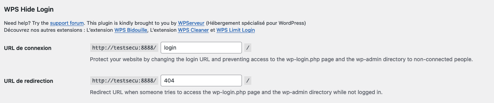

<h1 align="center">SECURE YOUR WORDPRESS</h1>                   
<p align="center"><srong>by Be Cyber Community</strong><br/><i>-- Tyc-Tac & Cr4Sh --</i></p>


***Pour qui ?***
>
>  Ce support est destiné à toute personnes souhaitant sécuriser son site / blog basé sur un **CMS Wordpress**, même sans connaissances poussées en développement ni en réseau.
>
> Les propos seront donc ***le plus vulgarisés possibles*** afin de vous accompagner, étape par étape, pour la mise en place des bonnes pratiques et l'installation de plugins reconnus en la matière.
>
> Nous vous proposons ici une liste non exhaustives de plugins et outils reconnus dans le domaine de la cybersécurité et qui ont fait leurs preuves. 


***Disclaimer***
>
> *Par définition un système d'information ne peut être inviolable et la cybersécurité évolue à une vitesse importante. Ce support ne peut garantir une sécurité sans faille face aux risques de piratage.*
>
> *Nous déclinons donc toute responsabilité quant à la mise en pratique des éléments de ce support, des outils et plugins utilisés, nous ferons cependant de notre mieux pour maintenir ce support à jour au fur et à mesure des évolutions dans le domaine.*

-----

***Date de mise à jour 2024-03-24***

- [ ] Avant de commencer l'installation 
- [ ] [Installation Best Practice](#best-practice)
- [ ] [Installation de plugins](#install-plugins)
- [ ] [Hide Login Page](#hide-login-page) 
- [ ] [Limit Brute Force Login](#bf-login)
- [ ] [Firewall, scanning & 2FA](#waf-scan) 
- [ ] Remove WP version
- [ ] Remove Yoast SEO Version
- [ ] Remove Remove Divi Version
- [ ] Remove Cookie Notice Version
- [ ] Remove Lite Speed Version
- Bonnes pratiques sauvegardes + mise à jour.
- Zip + hash (Comment vérifier l'intégrité ex => fichier base lors de mise en ligne + à chaque sauvegarde + garder antériotité)

# Avant de commencer l'installation


<hr id="best-practice" />

# Installation - Best practice 

<details>
<summary>Installer et sécuriser Apache</summary>

## Installation Apache
```bash
#installation des dépendences
apt install ca-certificates apt-transport-https software-properties-common lsb-release curl -y

#installation d'apache
apt install apache2-utils libapache2-mod-security2 apache2 -y
apt info apache2
```

## Créer un groupe pour Apache :
```bash
addgroup --system "votre-groupe" 

#Créer un utilisateur pour Apache :
adduser --system --no-create-home --disabled-login --ingroup "votre-groupe" --disabled-password "votre-utilisateur"
#Cette commande crée un utilisateur système nommé "votre-utilisateur" sans un répertoire personnel (--no-create-home), sans possibilité de se connecter (--disabled-login), et le place dans le groupe "votre-groupe".


#Supprimer l'utilisateur www-data :
deluser www-data
Assurez-vous qu'il n'y a pas de services ou de processus critiques qui dépendent de cet utilisateur avant de le supprimer.

#Supprimer le groupe www-data :
delgroup www-data

#une fois cela, fait-on modifier le fichier envars
nano /etc/apache2/envvars
export APACHE_RUN_USER="votre-utilisateur"
export APACHE_RUN_GROUP="votre-groupe"
#On redémarre le serveur apache
systemctl restart apache2
```

## Configuration apache
### Tout se passe dans le fichier */etc/apache2/conf-available/security.conf* :

```
#Cachez la version du serveur apache
ServerTokens Prod
ServerSignature Off

#Désactivez la méthode TRACE
TraceEnable Off

#Configurez X-Frame-Options
Header always append X-Frame-Options SAMEORIGIN

#Activez X-XSS-Protection
Header always set X-XSS-Protection: "1; mode=block"

#Réduire les risques de sécurité de type MIME
Header always set X-Content-Type-Options: "nosniff"

#HSTS
Header always set Strict-Transport-Security "max-age=31536000; includeSubDomains"

#Sécurisation des cookies
Header always edit Set-Cookie ^(.*)$ $1;HttpOnly;Secure

#Désactivez les protocoles SSL/TLS obsolètes
nano /etc/apache2/mods-enabled/ssl.conf 
SSLProtocol -all +TLSv1.2
SSLCipherSuite HIGH:!aNULL:!MD5
```
### Nous devons ensuite activer certains modules:
```
# Modifcation des entêtes
a2enmod headers 

#Réécriture des urls
a2enmod rewrite

#Activation de ssl pour https
a2enmod ssl

#Activation de php
a2enmod php8.*

#Autres options disponible
#a2enmod cache Pour activer le mode cache 
#a2enmod cache_disk Pour activer le mode cache
systemctl reload apache2
```
### Pour tester en local nous utilisons curl
```bash
curl -v http://localhost:80/ | head
```

> Nous avons correctement configuré notre serveur apache enjoy !!

</details>

<details>
<summary>Installer et sécuriser Nginx</summary>

## Installation Nginx
```bash
apt-get install nginx && apt-get install nginx-extras
systemctl enable nginx
systemctl start nginx
systemctl status nginx

curl -I http://127.0.0.1/
#On voit la version de notre serveur nginx
```

```bash
#Désactiver la signature
nano /etc/nginx/nginx.conf
```
```
#Dans le fichier /etc/nginx/nginx.conf
server_tokens off;

#Modifier la ligne ssl comme suit TLS 1 et TLS 1.1 obsolète
ssl_protocols TLSv1.2 TLSv1.3; # Dropping SSLv3, ref: POODLE
```

```bash
systemctl reload nginx

curl -I http://127.0.0.1/
#La signature est bien désactivée, mais cela affiche nginx corrigeons cela

nano /etc/nginx/nginx.conf
```

```
#Dans le fichier /etc/nginx/nginx.conf

#Ajoutez cela en dessous du commentaire basic
more_set_headers 'Server: ';
```

```bash
systemctl reload nginx

curl -I http://127.0.0.1/
#Voilà parfait cela n'affiche plus nginx

nano /etc/nginx/nginx.conf
```

```
#Dans le fichier /etc/nginx/nginx.conf

#Ajout des protections pour les headers
more_set_headers "X-Content-Type-Options : nosniff";
more_set_headers "X-XSS-Protection : 1; mode=block";
more_set_headers "X-Download-Options : noopen";
more_set_headers "X-Permitted-Cross-Domain-Policies : none";
more_set_headers "X-Frame-Options : SAMEORIGIN";
#Vous pouvez ajouter CSP
```

```bash
systemctl reload nginx

curl -I http://127.0.0.1/
#pour la sécurité, c'est tout, mais vous pouvez envisager bien plus au niveau de vos optimisations
```
</details>

<details>
<summary>Installer et sécuriser PHP</summary>

## PHP
> Nous allons installer php8.3 qui est la dernière version de php

```bash
#Récuperation de la clé
curl -sSLo /usr/share/keyrings/deb.sury.org-php.gpg https://packages.sury.org/php/apt.gpg

#Ajout aux sources
sh -c 'echo "deb [signed-by=/usr/share/keyrings/deb.sury.org-php.gpg] https://packages.sury.org/php/ $(lsb_release -sc) main" > /etc/apt/sources.list.d/php.list'

#Mise à jour
apt update

#Installation des paquets php utilisés par Wordpress
apt-get install php8.3 php8.3-cli php8.3-common php8.3-imap php8.3-redis php8.3-snmp php8.3-xml php8.3-mysqli php8.3-zip php8.3-mbstring php8.3-curl libapache2-mod-php8.3 -y

#Voir la version
php -v

#Ajout du fichier phpinfo pour voir notre configuration
echo "<?php phpinfo(); ?>" | tee /var/www/html/phpinfo.php
```
```
#Ouvrir la page
http://url/phinfo.php
```
> Comme vous pouvez le voir un certain nombre de choses ne sont pas bonnes d'un point de vu sécurité

### Sécurisation de php
```bash
#Tout se passe ici
nano /etc/php/8.3/apache2/php.ini
```
```
#Désactivation d'un certain nombre de functions inutiles dans notre cas

disable_functions = exec,passthru,shell_exec,system,proc_open,popen,curl_exec,curl_multi_exec,parse_ini_file,show_source,eval,assert,stream_socket_server,stream_socket_accept,stream_socket_client,stream_set_blocking,fsockopen,fputs,fwrite,create_function,pcntl_exec,pcntl_fork,pcntl_signal,pcntl_waitpid,pcntl_wexitstatus,pcntl_wifexited,pcntl_wifstopped,pcntl_wifsignaled,pcntl_wifcontinued,pcntl_wstopsig,pcntl_wtermsig,pcntl_strerror,pcntl_get_last_error,pcntl_signal_dispatch,pcntl_sigprocmask,pcntl_sigwaitinfo,pcntl_sigtimedwait,pcntl_async_signals,pcntl_unshare,pcntl_setpriority,pcntl_getpriority

#Désactivation de la version de php
expose_php = Off

#Révocation l'inclusion de fichier
allow_url_include = Off

#Seuls les fichiers dans votre site Web peuvent être inclus
allow_url_fopen = Off
```

> php est sécurisé 

</details>

## Installation de Mariadb
```bash
#Installation de Mariadb
apt install mariadb-server -y

#Activation 
systemctl enable mariadb

#Démmarrage
systemctl start mariadb

#Vérification
systemctl status mariadb

#Sécurisation de votre installation avec des mots de passe fort 
mariadb-secure-installation

#Connexion à Mariadb
mysql -u root -p
```

```sql
--Création de nos tables pour Wordpress
CREATE USER 'anyone'@'localhost' IDENTIFIED BY 'YourStrongPasswordHere';
 CREATE DATABASE  tstSecure;
 GRANT ALL PRIVILEGES ON tstSecur.* TO 'anyone'@'localhost';
 FLUSH PRIVILEGES;
 EXIT;
```
## Nous devons ensuite Télécharger Wordpress

```bash
cd /var/www/html

wget https://wordpress.org/latest.zip

unzip latest.zip

rm latest.zip
```

<hr id="hide-login-page" />

# Hide Login Page

Les premières tentatives de brute force login via wordpress se font généralement aux adresses  ``votresite.fr/wp-admin.php`` ou ``votresite.fr/login`` ou ``votresite.fr/wp-login.php`` qui sont les 3 moyens d'accéder nativement à votre interface de connexion.

Il est donc primordial de "cacher" l'accès à cette interface du grand public en la personnalisant grâce à un plugin de type ``WPS Hide Login`` qui vous permettra de personnaliser le lien d'accès.

<a id="install-plugin-step"></a>

## Les étapes d'installation d'un plugin

1. Sur votre interface d'administration Wordpress, rendez-vous sur ``Extensions > Ajouter une extension``

2. Dans le champs de recherche tapez ``WPS Hide Login``

3. Sélectionnez le plugin ``WPS Hide Login`` et cliquez sur "plus de détails"


> NB : Pensez à vérifier les informations d'un plugin ou d'un thème avant installation, notamment : 
> - ``Auteur/autrice`` ici WPServeur, NicolasKulka,wpformation
> - ``Dernière mise à jour`` (une mise à jour trop éloignée n'est généralement pas signe de fiabilité)
> - ``Nécessite Wordpress en version`` ET ``Compatible jusqu'à la version``, vous trouverez la version de votre Wordpress sur le coin inférieur droit de votre espace d'administration
- ``Installations actives``, un nombre élevé, avec de bonnes notes est généralement signe d'un plugin de qualité, surtout si la dernière mise à jour est assez récente.

<p align="center"></p>

4. Si le plugin vous convient, cliquez sur le bouton ``Installer maintenant``

## L'activation & les réglages

1. Votre module est maintenant installé, il faut maintenant cliquer sur le bouton ``Activer``. 

> NB : Si vous ne voyez pas le bouton Activer ou que vous avez cliqué sur un autre onglet sans faire exprès, il vous suffit de vous rendre dans la partie ``Extensions``, vous retrouverez alors la liste des plugins installés, il vous suffit maintenant de l'activer. 

2. Une fois activé, cliquez sur ``Réglages``sur votre plugin ou rendez-vous dans la partie ``Réglages > WPS Hide Login`` depuis votre menu administrateur.

<p align="center"></p>

3. Tout en bas de cette page, vous trouverez la partie liée à votre plugin :
  
  <p align="center"></p>

  - ``URL de connexion`` qui sera le lien avec lequel vous vous connecterez : modifiez "login" par le mot que vous souhaitez (ici en exemple à ne pas réutiliser : ``super-connexion``)
  
  <p align="center"></p>

  - ``URL de redirection``qui sera la page vers laquelle seront redirigés les personnes tentant d'accéder aux pages ``votresite.fr/wp-admin.php``, ``votresite.fr/wp-login.php``, ``votresite.fr/login`` (nous garderons dans l'exemple la page 404 qui sert aux pages introuvables)

  - Pensez ensuite à bien ``Enregistrer les modifications``


> NB : À partir de maintenant, rappelez-vous que pour vous connecter, vous devrez utiliser le lien que vous avez indiqué en ``URL de connexion``, dans notre exemple : ``votresite.fr/super-connexion``


<hr id="bf-login" />


# Limit Brute Force Login

*Une attaque par force brute (bruteforce attack) consiste à tester, l’une après l’autre, chaque combinaison possible d’un mot de passe ou d’une clé pour un identifiant donné afin se connecter au service ciblé.* source:[CNIL](https://www.cnil.fr/fr/definition/force-brute-attaque-informatique)

La première chose à faire pour en limiter les effets est de limiter le nombre de tentatives et de bloquer les attaquants sur une période définie afin de les ralentir et de leur compliquer la vie.

Il existe plusieurs manières de faire et plusieurs outils, nous allons donc ici vous en présenter un qui se nomme ``WPS Limit Login``.

De la même manière que lors de l'installation du plugin ``WPS Limit Login``, il faut le rechercher, l'installer et l'activer.

> NB : si vous avez besoin d'un rappel, je ne vais pas rentrer dans le détail, mais vous trouverez la procédure ici => [étapes d'installation d'un plugin](#install-plugin-step)

<p align="center"></p>

## Les réglages

Lorsque vous accédez aux réglages de ``WPS Limit Login``, vous tombez sur le premier onglet ``Configuration``, dans lequel vous trouverez tous les paramétrages liés aux tentatives de connexion et aux limites que vous souhaitez fixer. (Nous verrons les autres onglets plus tard).

### Onglet Configuration

<p align="center"></p>

1. Définissez le nombre de tentatives que vous souhaitez autoriser avant blocage ainsi que le temps de blocage souhaité pour l'adresse IP ayant fait les tentatives de brute force. 

> NB : Par défaut, 3 tentatives sont autorisées avant blocage et la durée pour le premier blocage est de 20 minutes. (Le temps durant lequel cette adresse IP ne pourra pas recommencer la procédure de connexion.)

2. Paramétrez le nombre d'heures jusqu'à ce que le nombre de tentatives soient réinitialisées. 

> NB : Par défaut, le plugin est paramétré sur 12 heures, ce qui veut dire que, si une adresse IP tente de se connecter plusieurs fois au cours d'une période de 12 heures d'affilés et que les identifiants de connexions sont erronés, les paramètres définis au point 1 seront pris en compte.

3. Paramétrez le nombre de tentatives supplémentaires et la durée de blocage pour cette nouvelles série de tentatives.

> NB : L'adresse IP ayant été bloquée 20 min suite à 3 tentatives de connexion erronées ( données par défaut comme expliqué au point 1), pourra de nouveau faire un certains nombre de tentatives avant d'être à nouveau bloquées selon cette nouvelle règle.
> Par défaut, le plugin autorise 2 tentatives supplémentaire une fois l'adresse IP débloquée. Si ces tentatives sont erronées, l'adresse IP sera cette fois bloquée pour 24 heures.

4. Afin de pouvoir être informé en cas de tentative de brute force, nous vous conseillons d'activer l'envoi d'e-mail à l'administrateur. 

> NB : Attention, un nombre trop élevé ici, peut être dangereux car vous risquez de ne pas voir suffisamment tôt les tentatives. Cependant, un nombre très bas, peut engendrer un grand nombre de mails. N'hésitez pas à tester, pour l'exemple, nous allons le laisser à 2. 

5. Nous allons donc, pour l'exemple, décocher ``Afficher le lien de crédit``.

> NB : Concernant le lien de crédit, nous partons du principe que plus il y a d'informations visible sur un système d'informations (ici pour votre site internet), plus on facilite la reconnaissance / énumération et la découverte de failles potentielles. 
> 
> Attention, il est primordial de soutenir les plugins et tout l'environnement gratuit / open source que vous utilisez et c'est pourquoi nous vous conseillons d'émettre un avis sur un plugin ou outils que vous utiliseriez ou d'en parler autour de vous, mais ici, le fait d'afficher publiquement que le *formulaire de connexion est protégé par WPS Limit Login* pourrait aider lors d'une phase de reconnaissance ce qui serait de notre avis contre productif.

6. Pensez à enregistrer vos modifications avant de changer d'onglet.

### Onglet Liste blanche

Cet onglet vous permet de définir les adresses IP qui n'auront aucune limite de tentatives et qui ne seront jamais bloquées. 

Sauf cas particulier (et auquel cas, vous avez suffisamment de compétence pour gérer ce point), nous vous conseillons de ne poser aucune adresse IP en liste blanche. 

> NB : Vous connaissez votre mot de passe, en cas d'oubli, vous pouvez demander un nouveau mot de passe via le bouton ``Mot de passe oublié`` qui vous enverra un e-mail sur votre adresse d'administration.

### Onglet Liste noire

Cet onglet vous permet de définir les adresses IP que vous connaissez comme malveillantes via les outils de Cyber Threat Intelligence ou car elles apparaîssent souvent dans vos logs ou dans les tentatives de connexion par brute force. 

Par exemple, avec Be Cyber Community, nous avons référencé un grand nombre d'adresses IP malveillantes que vous trouverez ici [Malicious Ip Adresses - Be Cyber Community](https://github.com/duggytuxy/malicious_ip_addresses) et que vous pouvez utiliser pour enrichir votre liste noire.

<p align="center"></p>

### Onglet Journal de blocage

Enfin, vous retrouverez ici les statistiques de tentatives de brute force sur votre page de connexion ainsi que le journal de blocage.

<p align="center"></p>

<hr id="waf-scan" />

# Firewall & scanning & 2FA

***Firewall***
> Un pare-feu (firewall) sur votre wordpress vous aidera à protéger votre site wordpress des attaques en identifiant et bloquant le trafic malveillant.

***Scanning***
> Un scanner vous permet de bloquer du code ou contenu malveillant, de vérifier si vos fichiers ont été modifiés ...

***2FA***
> Two Factor Authentication (2FA) vous permet de rajouter une couche de sécurité sur votre site Wordpress lors de la connexion

Pour ce faire nous pouvons vous conseiller 2 outils, ``CrowdSec`` et ``Wordfence``


## CrowdSec 

De la même manière que précédemment, il faut rechercher le plugin ``CrowdSec``, l'installer et l'activer.

> NB : si vous avez besoin d'un rappel, vous trouverez la procédure ici => [étapes d'installation d'un plugin](#install-plugin-step)

// TODO


## Wordfence

De la même manière que précédemment, il faut rechercher le plugin ``Wordfence Security – Pare-feu, scanner de logiciels malveillants, et sécurité de connexion ``, l'installer et l'activer.

> NB : si vous avez besoin d'un rappel, vous trouverez la procédure ici => [étapes d'installation d'un plugin](#install-plugin-step)

<p align="center"></p>

## Les réglages

Une fois le plugin installé, vous devriez arriver sur une page vous demandant de rentrer votre licence ``Wordfence``ou de vous inscrire. 

<p align="center"></p>

1. Nous partons du principe que vous n'avez pas de licence, vous devrez donc en créer une.

> NB : Vous avez 4 licences disponibles, vous pouvez choisir celle qui vous convient le mieux. Notez que la licence "Free" fonctionne plutôt bien mais vous ne bénéficierez pas de la mise à jour des nouvelles menaces en temps réel, mais avec un différé de 30 jours après leurs découvertes.

Une fois avoir créé un compte et avoir choisi votre licence, vous recevrez votre numéro de licence par e-mail. 

2. Sur votre module Wordfence, cliquez sur ``Install an existing license``, 

<p align="center"></p>

- Renseignez votre e-mail de connexion 
- Ainsi que le numéro de votre licence reçue par e-mail (attention, votre licence doit rester confidentielle, ne la partagez pas, il s'agit ici, dans l'exemple, d'un nombre pris au hasard)
- Cliquez ensuite sur ``YES`` pour accepter de recevoir des e-mails sur les alertes de sécurité et de vulnérabilités.

<p align="center"></p>

> Félicitations, votre licence est valide, vous n'avez plus qu'à rejoindre le Dashboard.

### Dashboard

Sur votre Dashboard, vous trouverez les parties liées au ``Firewall``, au ``Scan``, ``Notifications`, vous pouvez suivre le didacticiel lors du premier affichage.

<p align="center"></p>

> NB : Lors de votre arrivée sur le Dashboard, vous trouverez en haut un alerte en rouge, vous demandant d'activer les mises à jour automatiques du plugin. 

1. Nous vous conseillons de les mettre en application ou de faire vos mises à jour très régulièrement. 

> NB : Il est une bonne pratique de mettre très régulièrement à jour vos plugins et thèmes ou versions de Wordpress. Pensez cependant à faire des sauvegardes régulières de votre Wordpress AINSI QUE de votre base de données.

2. Cliquez sur ``Manage Firewall`` pour commencer à configurer ``Wordfence``.

### Firewall 

***Basic Firewall Options***

<p align="center"></p>

1. Web Application Firewall Status (WAF)

Par défaut, lors de l'installation de Wordfence, le mode d'apprentissage est enclenché pendant 1 semaine. Il permettra au plugin d'apprendre comment le protéger par la suite sans bloquer les utilisateurs légitimes. 

Au bout d'une semaine il enclenchera automatiquement le pare-feu.

2. Protection level

Lors de l'installation, le "Basic Wordpress Protection" est d'office activé. Cependant, il pourra bloquer de nombreuses requête malveillante une fois le plugin chargé, mais certains plugins vulnérables ou Wordpress pourront parfois réussir à exécuter du code malveillant sans passer par le pare-feu.

Il est donc primordial d'optimiser le processus en modifiant la configuration PHP afin de lancer le pare-feu avant Wordpress ou un autre fichier PHP. 

Pour se faire, il est nécessaire de modifier certains fichiers (en fonction de votre serveur) comme le ``.htaccess``, le ``php.ini``...

> NB : Dans tous les cas, ***AVANT TOUTE MODIFICATION***, il est primordiale de faire un sauvegarde intégrale de votre site et de votre base de données, afin de pouvoir remettre votre site en ligne en cas d'anomalie lors d'une mise à jour ou d'une erreur de configuration.

<p align="center"></p> 

- En cliquant ``OPTIMIZE THE WORDFENCE FIREWALL``, vous aurez la possibilité de choisir la configuration serveur dont vous avez besoin. Le plugin vous proposera un fichier de configuration basé sur ses propres test.

- Téléchargez le fichier de configuratin en cliquant sur le bouton ``DOWNLOAD .HTACCESS``(dans le cadre de notre exemple avec Apache + mod_php, sinon veuillez suivre les informations adaptées pour votre serveur)

<p align="center"></p> 

- Une fois téléchargé et installé à la racine de votre wordpress et cliquez sur continuer.

> NB : Dans certains cas, il se peut que la mise en cache de votre serveur ou si vous utilisez un plugin pour le cache, retarde de quelques instants les nouveaux paramétrages. N'hésitez pas à recharger la page du Firewall pour vérifier que les modifications aient bien été prise en compte.

<p align="center"></p> 

***Advanced Firewall Options***

Vous pourrez effectuer des réglages avancés en retardant les blockage IP, en autorisant certaines adresses IP à retarder les règles de pare feu ...

<p align="center"></p> 

Par défaut, vous n'avez pas besoin d'y toucher sauf dans le cas où vous souhaiteriez affiner le pare-feu. 


***Brute Force Protection***

<p align="center"></p> 

- Assurez-vous que la protection contre les attaques par brute force soient activée, si ce n'est pas le cas, cliquez sur ``ON``

> NB : Vous pourrez affiner le nombre de tentatives autorisées, le temps de blocage (comme dans le module ``WPS Limit Login`` installé précédemment).

- Vous pouvez choisir de bloquer immédiatement toute personne qui utiliserait un nom d'utilisateur invalide pour la connexion.

> NB : Attention, le fait d'immédiatement bloquer une personne après avoir utiliser un identifiant invalide peut faciliter l'énumération des utilisateurs existants. 

- Vous pouvez immédiatement bloquer toute personne utilisant certains nom d'utilisateurs, comme par exemple ``admin``, ``user``, ``root`` ... Pour cela, il vous suffit de rentrer le nom d'utilisateur qui déclenchera le bloquage et d'appuyer sur la touche ``Enter`` 

- Empêchez l'utilisation de mot de passe ayant fait l'objet d'une fuite de donnée pour tous les utilisateurs qui ont le droit de publier.

Dans la partie ``Additional Options``

<p align="center"></p> 

- Forcer l'utilisation d'un mot de passe fort pour tous les utilisateurs.

- Ne laissez pas Wordpress révéler les utilisateurs valides dans les erreurs de connexion.

- Empêchez les utilisateurs d'enregistrer un nom d'utilisateur ``admin`` même s'il n'existe pas déjà.

- Empêchez la découverte des noms d'utilisateurs par les scans, oEmbed, API Rest Wordpress ou encore les sitemap XML de Wordpress.

- Désactivez les mots de passe d'applications de Wordpress.

- Bloquer toutes les adresses IP qui envoient des requêtes POST avec un ``user-agent`` et ``referer`` vides.

- Vérifier la force du mot de passe lors de la modification d'un profil utilisateur.

- Enfin, si vous souhaitez enrichir la base de connaissance sécuritaire de la communauté vous pouvez envoyer de manière anonyme des informations sur les tentatives de piratage. 

***Rate Limiting***

<p align="center"></p> 

- Choisissez comment vous souhaitez traiter les robots d'indexation de Google : ``Ici, nous prenons le parti de ne pas limiter les robots de Google qui sont vérifiés``

Nous allons décider du comportement (limité ou bloqué) à prendre lorsque le nombre d'évènements par minutes va être dépassé pour les points suivants :

- Le nombre de requêtes de n'importe qui

- Le nombre de pages vues par un crawler (robot)

- Le nombre de pages non trouvées (404 not found) par un crawler (robot)

- Le nombre de pages vues par un humain

- Le nombre de pages non trouvées (404 not found) par un humain

> NB : Pour les points ci-dessus, attention à vos choix et à ne pas être trop incisif dans vos décisions. Une alerte apparaîtra si vous êtres un peu trop sévère, mais dans tous les cas, évitez le ``Unlimited``

- Pendant combien de temps une adresse IP est bloquée lorsqu'elle enfreint une règle ? Nous règlerons ici à 30 minutes pour l'exemple.

***Rate Limiting***

<p align="center"></p> 

Cette partie vous permettra définir des URL qui ne seront pas prise en compte par le pare-feu. Elles peuvent également être ajouter automatiquement lorsque le pare-feu est en mode d'apprentissage.

Si vous ne savez pas précisément ce que vous faites, laissez cette partie telle quelle.

Enfin pensez à sauvegarder les changements en cliquant sur le bouton ``Save Changes``en haut à droite.

### Scan

<p align="center"></p>

Dans cette partie, Wordfence va vous permettre de scanner votre site :

- De manière régulière pour étudier les vulnérabilités liées à des fichiers qui auraient été modifiés ou des plugins/thèmes qui auraient besoin de mises à jour.

- De manière manuelle, de manière à lancer un scan total de votre site Wordpress en cliquant sur ``Start New Scan``

> NB : Une fois le scan fini, vous aurez le détail du scan disponible en cliquant sur ``Show Log``, ainsi que les parties validées ou présentant une erreur. 


### Live Trafic

Le Live Trafic (trafic en direct), affiche par défaut un résumé de tout le trafic lié à la sécurité et à quoi le trafic est-il rattaché? (Human, Bot, Warning, Blocked).

<p align="center"></p>

***Live Trafic Options***

Vous pouvez également affiner votre Live Trafic en choisissant :

- Le mode d'enregistrement du trafic : ``Security Only`` ou ``All Trafic``. (Nous garderons le mode Security car le All Trafic peut facilement se révéler conséquent et être contre productif et peut coûter cher en terme de ressources)

- Si vous ne souhaitez pas suivre les utilisateurs avec un accès de publication (administrateur, éditeur ...) afin qu'il ne se retrouvent pas dans le live trafic, il faudra cocher cette case.

- Vous pouvez choisir les utilisateurs que vous souhaitez ignorer, en les séparant par une virgule ``,`` 

- Vous pouvez également ignorer des adresses IP en les ajoutant et en les séparant par une virgule ``,``

- Renseignez ensuite la liste des ``user-agent`` que vous souhaitez ignorer 

> NB : Nous vous conseillons de ne toucher aux 3 précédents points, que si vous savez ce que vous faites

- Choisissez le nombre de lignes maximum qui seront sauvegardées ( 2000 par défaut )

- Ensuite, choisissez le nombre de jour durant lesquels vous conserverez les données de trafic, entre 1 et 30 jours ( 30 par défaut )

<p align="center"></p>

### Login Security 

C'est ici que vous pourrez activer l'authentification à deux facteurs (2FA ou Two-Factor Authentication). 

Il s'agit d'une méthode pour rajouter une couche de sécurité lors de la connexion à votre site Wordpress, car une fois avoir rentré vos identifiants et mots de passe, Wordfence vous demande un code pour valider la connexion.

> NB : Nous vous conseillons fortement de mettre en place l'authentification multi-facteur (MFA / 2FA) partout où vous le pouvez, que ce soit sur logiciels de messagerie e-mails, vos réseaux sociaux, vos banques, sites administratifs (partout où cela est possible).

<p align="center"></p>

***Activation de l'authentification à 2 facteurs***

1. Choisissez l'application que vous souhaitez utiliser pour mettre en place votre authentification à 2 facteurs

> NB : Il est écrit dans la liste que Wordfence accepte les Apps TOTP (comprendre ``Time-Based One-time Password``) suivantes : Google authenticator, FreeOTP, LastPass authenticator, Microsoft authenticator ... (nous vous invitons à suivre le liens présent sur votre page pour avoir la liste exhaustive et en temps réel)

2. Scannez le QRCode présent à l'écran dans votre application TOTP (Si vous n'avez pas d'appareil photo fonctionnel, vous pouvez aussi renseigner le code qui est sous le QRCode).

3. OPTIONNEL : Téléchargez les code de récupération et sauvegardez les de manière sécurisé dans un trousseau prévu à cet effet, ``Ne les laissez jamais en accès libre dans votre dossier de téléchargement, sur votre bureau ou autre``.

4. Renseignez le code généré par votre application TOTP afin de valider l'authentification à deux facteurs. 

> **ATTENTION** : nous vous présentons ici le QRCode, le code ainsi que les code de récupération en clair pour l'exemple car l'installation est faite sur un LAB en local, destiné à cet effet et sera effacé dès la fin de la rédaction de ce guide. ***``NE DÉVOILEZ JAMAIS VOTRE QRCODE, LE CODE EN DESSOUS, NI LES CODE DE RÉCUPÉRATION, ILS SONT PRIVÉS ET DOIVENT ÊTRE GARDÉS EN LIEU SÛR AFIN D'ÉVITER TOUTE UTILISATION MALVEILLANTE``***

***Settings***

Dans cette partie, nous allons régler tout ce qui est lié à l'authentification à 2 facteurs que nous venons de mettre en place. 

## WORK IN PROGRESS